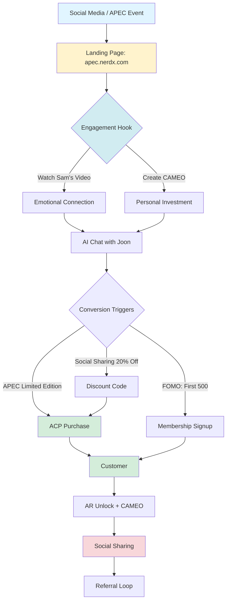

# 🚀 NERDX APEC MVP: Executive Summary

## 프로젝트 개요

**목표**: 2025년 10월 말 APEC CEO SUMMIT에서 샘 올트먼과 함께 "한국의 즐거움"을 소개하고, OpenAI Sora 2를 활용한 초개인화 CAMEO 콘텐츠로 NERDX 자사몰 플랫폼 멤버십 가입을 극대화하는 통합 시스템 구축

**핵심 전략**: "미식 산업의 Netflix" 비전 실현을 위한 Phase 1/2/3 통합 MVP (월드 모델 + 에이전틱 시스템 + 몰입형 커머스)

---

## 📁 프로젝트 구조

```
nerdx-apec-mvp/
│
├── docs/                                    # 📚 핵심 문서
│   ├── APEC_SUMMIT_STRATEGY.md             # APEC 전략 및 Sam Altman 콘텐츠
│   ├── INTEGRATED_SYSTEM_ARCHITECTURE.md   # 통합 시스템 아키텍처
│   └── PROJECT_TIMELINE_DETAILED.md        # 상세 프로젝트 타임라인 (26주)
│
├── sora-content-pipeline/                   # 🎬 Sora 2 콘텐츠
│   ├── SORA2_PROMPTS_LIBRARY.md            # 전체 비디오 프롬프트 (티저, 메인, CAMEO)
│   ├── templates/                          # CAMEO 템플릿
│   └── assets/                             # 비디오 에셋
│
├── phase1-world-model/                      # 🧠 Phase 1: 기반 구축
│   ├── neo4j/                              # 지식 그래프 스키마
│   ├── api/                                # World Model API
│   └── agents/                             # Maeju (Storyteller Agent)
│
├── phase2-agentic-system/                   # 🎥 Phase 2: 몰입형 경험
│   ├── sora-service/                       # Sora 2 통합 서비스
│   ├── cameo-pipeline/                     # CAMEO 생성 파이프라인
│   └── video-processing/                   # 후처리 및 CDN 업로드
│
├── phase3-conversion/                       # 💰 Phase 3: 커머스 통합
│   ├── commerce-service/                   # ACP 기반 주문 처리
│   ├── agents/                             # Joon (Concierge Agent)
│   └── ar-service/                         # AR 경험 관리
│
├── infrastructure/                          # ☁️ 인프라
│   ├── kubernetes/                         # K8s manifests
│   ├── terraform/                          # IaC
│   ├── monitoring/                         # Prometheus, Grafana
│   └── ci-cd/                              # GitHub Actions workflows
│
└── scripts/                                 # 🛠️ 유틸리티 스크립트
    ├── setup-dev-env.sh                    # 로컬 개발 환경 셋업
    ├── deploy.sh                           # 배포 스크립트
    └── data-migration/                     # 데이터 마이그레이션
```

---

## 🎯 핵심 목표 및 지표

### Business Goals (APEC Campaign)
| 지표 | 목표 | 측정 시점 |
|---|---|---|
| 멤버십 가입 수 | 5,000명 | APEC 기간 중 (Week 26) |
| CAMEO 생성 수 | 20,000개 | ~ APEC Day |
| 소셜 공유율 | 40% | CAMEO 생성자 대비 |
| 랜딩페이지 전환율 | 15% | 방문자 → 가입/구매 |
| 미디어 노출 | 100+ | 글로벌 매체 언급 |

### Technical Goals
| 지표 | 목표 |
|---|---|
| CAMEO 생성 시간 | < 2분 |
| CAMEO 생성 성공률 | > 95% |
| 시스템 Uptime (APEC Day) | 99.9% |
| API 응답 시간 (p95) | < 500ms |
| 동시 사용자 지원 | 1,000명 |

---

## 🏗️ 시스템 아키텍처 요약

### 3 Phase 통합 구조

```
┌─────────────────────────────────────────────────────────────┐
│                    USER EXPERIENCE                           │
│                                                              │
│  1. Discovery (Phase 1)                                      │
│     └─> Chat with Maeju AI → Learn NERD brand stories       │
│                                                              │
│  2. Immersion (Phase 2)                                      │
│     └─> Create personalized CAMEO video with Sam Altman     │
│                                                              │
│  3. Conversion (Phase 3)                                     │
│     └─> Purchase with Joon AI → Unlock AR experiences       │
│                                                              │
└─────────────────────────────────────────────────────────────┘
                            ▼
┌─────────────────────────────────────────────────────────────┐
│                  WORLD MODEL (Neo4j)                         │
│       Single Source of Truth for All Interactions          │
│                                                              │
│  Products ←→ Ingredients ←→ Lore ←→ Users ←→ Content       │
│                                                              │
└─────────────────────────────────────────────────────────────┘
```

### 핵심 기술 스택
- **Frontend**: Next.js 14, React 18, TailwindCSS
- **Backend**: Python FastAPI, Node.js
- **AI/ML**: OpenAI GPT-4, Sora 2, LangChain
- **Database**: Neo4j (Graph), PostgreSQL (Relational), Redis (Cache)
- **Commerce**: Stripe ACP
- **AR**: ARKit / ARCore
- **Infrastructure**: AWS/GCP, Kubernetes, CloudFlare CDN
- **Monitoring**: Prometheus, Grafana, Jaeger

---

## 📅 프로젝트 타임라인 (하이라이트)

```
Week 0  (4/15)  : 프로젝트 킥오프 ━━━━━━━━━━━━━━━━━━━━━━━━━━━━► Week 26 (10/25) : APEC D-Day

M1  (Week 0)  : 킥오프 & 환경 셋업
M2  (Week 6)  : Phase 1 Alpha (Maeju 작동)
M3  (Week 12) : Phase 1 Beta (텍스트 기반 완성)
M4  (Week 14) : Sam Altman 촬영 완료 ★
M5  (Week 16) : Phase 2 Alpha (첫 CAMEO 생성)
M6  (Week 20) : 티저 콘텐츠 런칭
M7  (Week 22) : 메인 콘텐츠 런칭 (Sam's Journey)
M8  (Week 24) : Phase 3 Beta (ACP + AR 작동)
M9  (Week 25) : 통합 테스트 완료
M10 (Week 26) : APEC 공식 런칭 🎉
```

**Critical Path**:
1. Sam Altman 일정 확보 및 촬영 (Week 13-14)
2. Sora 2 API 조기 액세스 (Week 7 이전)
3. CAMEO 시스템 안정화 (Week 16-18)

---

## 🎬 APEC 콘텐츠 전략 핵심

### "Sam's Korean Joy Journey"

#### 3 Phase Content

**Phase 1: 티저 (Week 20, 9월 첫째 주)**
- "Sam's Mysterious Package" (20초)
- "Portal to Korea" (30초)
- → 목표: 1M+ views, 호기심 유발

**Phase 2: 메인 영상 (Week 22, 9월 셋째 주)**
- 5-Part Epic (총 3분 30초):
  1. Sam at the Brewery (45s)
  2. NERD Innovation Lab (40s)
  3. **Sam's CAMEO Story** (60s) ← CENTERPIECE
  4. Phygital Experience (35s)
  5. Community Moment (30s)
- → 목표: 5M+ views, 글로벌 주목

**Phase 3: 인터랙티브 캠페인 (Week 22-26)**
- User CAMEO Templates:
  - "Traditional Tavern with Sam"
  - "Future K-Food Festival"
  - "Secret Recipe Mission"
- → 목표: 20K CAMEO created, 40% social sharing

### Sam Altman 메시지 포인트 (기조연설)

> "NERDX isn't just selling Korean alcohol. They're building a world model—not of text or images, but of cultural experience. When their AI asked me what I like, it didn't just recommend a product. It created a personalized video story using Sora, where I became part of Korean cultural heritage. **That's not e-commerce. That's immersive entertainment commerce.**"

---

## 🔗 전환 최적화 Funnel



### Key Conversion Levers
1. **감성적 연결**: Sam의 진정성 있는 스토리 (Sora 2 영상)
2. **개인화 경험**: 나만의 CAMEO 영상 창작
3. **희소성**: APEC 한정판 (500세트)
4. **마찰 제거**: ACP 원클릭 결제
5. **즉시 보상**: AR 경험 즉시 언락

---

## 💻 개발 Quick Start

### Prerequisites
- Node.js 18+
- Python 3.11+
- Docker & Docker Compose
- kubectl & Helm (for K8s deployment)
- Neo4j Desktop (or Docker)

### 로컬 개발 환경 셋업

```bash
# 1. Repository Clone
git clone https://github.com/nerdx/apec-mvp.git
cd apec-mvp

# 2. 환경 변수 설정
cp .env.example .env
# .env 파일을 편집하여 API 키 입력:
#   - OPENAI_API_KEY (GPT-4 + Sora 2)
#   - NEO4J_URI, NEO4J_USER, NEO4J_PASSWORD
#   - STRIPE_SECRET_KEY
#   - AWS_ACCESS_KEY, AWS_SECRET_KEY

# 3. Dependencies 설치
npm install              # Frontend
cd phase1-world-model && pip install -r requirements.txt  # Backend
cd ../phase2-agentic-system && pip install -r requirements.txt
cd ../phase3-conversion && npm install

# 4. 로컬 서비스 시작 (Docker Compose)
docker-compose up -d
# 이렇게 하면 다음이 실행됨:
# - Neo4j (localhost:7474)
# - PostgreSQL (localhost:5432)
# - Redis (localhost:6379)
# - MinIO (S3-compatible, localhost:9000)

# 5. 데이터베이스 초기화
npm run db:migrate       # PostgreSQL migrations
npm run db:seed          # 초기 데이터 씨딩

# 6. Neo4j World Model 초기화
cd scripts
python init_world_model.py
# 이렇게 하면 초기 제품, 재료, Lore 노드가 생성됨

# 7. 개발 서버 실행
# Terminal 1: Frontend
npm run dev              # http://localhost:3000

# Terminal 2: Phase 1 API
cd phase1-world-model
uvicorn main:app --reload --port 8001

# Terminal 3: Phase 2 API
cd phase2-agentic-system
uvicorn main:app --reload --port 8002

# Terminal 4: Phase 3 API
cd phase3-conversion
npm run dev              # http://localhost:8003

# 8. Health Check
curl http://localhost:8001/health  # Phase 1
curl http://localhost:8002/health  # Phase 2
curl http://localhost:8003/health  # Phase 3

# 9. 첫 대화 테스트
curl -X POST http://localhost:8001/api/v1/chat \
  -H "Content-Type: application/json" \
  -d '{"message": "Tell me about NERD", "user_id": "test-user"}'
```

---

## 🚀 배포

### Production Deployment (Kubernetes)

```bash
# 1. Docker 이미지 빌드 및 푸시
./scripts/build-and-push.sh

# 2. Kubernetes 클러스터 연결
kubectl config use-context nerdx-production

# 3. Secrets 생성
kubectl create secret generic nerdx-secrets \
  --from-env-file=.env.production

# 4. 배포 (Helm)
helm install nerdx-apec ./infrastructure/helm/nerdx-apec \
  --namespace production \
  --values ./infrastructure/helm/values-production.yaml

# 5. 배포 상태 확인
kubectl get pods -n production
kubectl get svc -n production

# 6. Ingress URL 확인
kubectl get ingress -n production
# 예상 URL: https://apec.nerdx.com
```

### 배포 전 체크리스트
- [ ] 모든 환경 변수 설정 완료
- [ ] Database migration 실행
- [ ] SSL 인증서 발급 (Let's Encrypt / AWS ACM)
- [ ] CDN 설정 (CloudFlare)
- [ ] 모니터링 대시보드 확인 (Grafana)
- [ ] 알림 규칙 설정 (PagerDuty / Slack)
- [ ] 백업 정책 확인
- [ ] Rollback 계획 수립

---

## 📊 모니터링 및 분석

### Key Dashboards

**System Health** (Grafana)
- CPU, Memory, Disk usage
- API response times (p50, p95, p99)
- Error rates
- Database connection pool

**Business Metrics** (Custom Dashboard)
- Real-time user count
- CAMEO generation queue length
- Conversion funnel (step-by-step)
- Revenue (hourly/daily)

**APEC D-Day Dashboard** (Special)
- Live visitor count
- CAMEO creations (real-time counter)
- Social media mentions (aggregated)
- System uptime %
- Critical alerts

### 접근 URL
- Grafana: https://monitoring.nerdx.com
- Kibana (Logs): https://logs.nerdx.com
- Jaeger (Tracing): https://tracing.nerdx.com

---

## 🤝 팀 및 연락처

### Core Team
- **Project Lead**: [Name] - [email]
- **Tech Lead**: [Name] - [email]
- **Product Manager**: [Name] - [email]
- **AI/ML Lead**: [Name] - [email]
- **DevOps Lead**: [Name] - [email]

### Stakeholders
- **NERDX CEO**: [Name]
- **OpenAI Partnership**: [Name]
- **APEC Liaison**: [Name]

### Communication Channels
- **Slack**: #nerdx-apec-mvp
- **Jira**: https://nerdx.atlassian.net/projects/APEC
- **GitHub**: https://github.com/nerdx/apec-mvp
- **Weekly Sync**: 매주 월요일 10:00 AM (Google Meet)
- **Sprint Review**: 격주 금요일 3:00 PM
- **Emergency Hotline**: [Phone number]

---

## 📚 추가 문서

### 상세 문서 (./docs/)
1. **APEC_SUMMIT_STRATEGY.md** - APEC 전략 전체 (콘텐츠, 전환 퍼널, 타임라인)
2. **INTEGRATED_SYSTEM_ARCHITECTURE.md** - 시스템 아키텍처 상세 (API 스펙, 데이터 모델)
3. **PROJECT_TIMELINE_DETAILED.md** - 26주 프로젝트 타임라인 (주차별, 리소스, 리스크)

### 콘텐츠 문서 (./sora-content-pipeline/)
4. **SORA2_PROMPTS_LIBRARY.md** - 모든 Sora 2 프롬프트 (티저, 메인, CAMEO 템플릿)

### API 문서
5. **API Reference**: https://api-docs.nerdx.com
6. **World Model Query Guide**: ./docs/world-model-queries.md

### 운영 문서
7. **Runbook**: ./docs/operations/runbook.md (장애 대응)
8. **Deployment Guide**: ./docs/operations/deployment.md
9. **Monitoring Guide**: ./docs/operations/monitoring.md

---

## 🏆 성공의 정의

### APEC Day Success Criteria

**Tier 1 (Must-Have)**
- ✅ Sam Altman 기조연설 중 라이브 데모 성공
- ✅ 시스템 Uptime 99%+ (no critical downtime)
- ✅ 500+ CAMEO 생성 (당일)
- ✅ 1,000+ 신규 가입 (당일)

**Tier 2 (Should-Have)**
- ✅ 10,000+ 사이트 방문자 (당일)
- ✅ 100+ 주문 (당일)
- ✅ 20+ 미디어 언급 (당일)
- ✅ 평균 CAMEO 생성 시간 < 2분

**Tier 3 (Nice-to-Have)**
- ✅ 샘 올트먼 트윗/소셜 포스트
- ✅ 바이럴 CAMEO (100K+ views)
- ✅ 경쟁사 벤치마킹 문의

---

## 💡 Next Steps

### Immediate Actions (Week 0)
1. [ ] 팀 킥오프 미팅 일정 잡기
2. [ ] GitHub Organization & Repositories 생성
3. [ ] AWS/GCP 계정 및 권한 설정
4. [ ] OpenAI Enterprise 계약 시작
5. [ ] Sam Altman 팀과 초기 미팅 (촬영 일정 조율)

### Week 1 Priorities
1. [ ] Sprint 1 백로그 정리 (Top 20 stories)
2. [ ] 개발 환경 모든 팀원 셋업 완료
3. [ ] Neo4j 스키마 v1.0 확정
4. [ ] 초기 프로토타입 (Static mockup) 검토

### Long-term Milestones
- **Week 6**: Phase 1 Alpha 데모
- **Week 14**: Sam 촬영 완료
- **Week 22**: 메인 콘텐츠 공개
- **Week 26**: APEC 런칭 🎉

---

## 🌟 Vision

> **"NERDX는 단순히 한국의 술을 판매하는 회사가 아닙니다. 우리는 문화를, 경험을, 그리고 개인의 이야기를 판매합니다. AI는 이 모든 것을 가능하게 하는 마법의 열쇠입니다. 2025년 10월 APEC에서, 우리는 세계에 증명할 것입니다: 미래의 커머스는 몰입형이며, 그 미래는 지금 시작됩니다."**

**— NERDX Team**

---

## 📞 Support

문제가 발생하거나 질문이 있으면:
- 🐛 **버그 리포트**: GitHub Issues
- 💬 **질문**: Slack #nerdx-apec-help
- 🚨 **긴급**: [Emergency Hotline]
- 📧 **일반 문의**: apec-support@nerdx.com

---

**Built with ❤️ by NERDX Team | Powered by OpenAI Sora 2 | #KoreanJoyWithNERDX**

---

## License

© 2025 NERDX. All Rights Reserved. Confidential and Proprietary.
