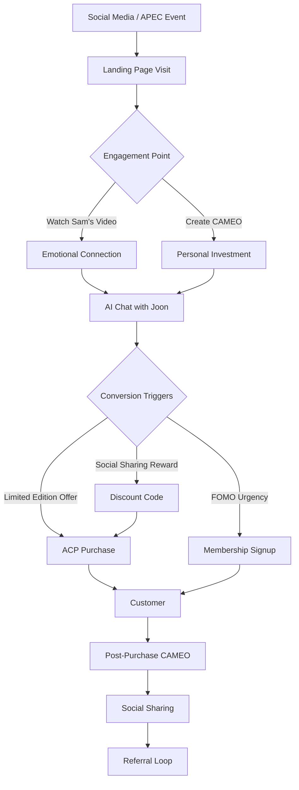

# APEC CEO SUMMIT 2025: 샘 올트먼과 함께하는 "한국의 즐거움" NERDX 전략

## 📅 프로젝트 개요
- **이벤트**: 2025 APEC CEO SUMMIT (경주)
- **목표일**: 2025년 10월 말
- **핵심 전략**: 샘 올트먼이 "한국의 즐거움"을 NERDX와 함께 소개
- **기술**: OpenAI Sora 2 활용 초개인화 콘텐츠 제작
- **목표**: NERDX 자사몰 플랫폼 멤버십 가입 전환 극대화

---

## 🎯 핵심 전략: "Sam's Korean Joy Journey"

### 컨셉
**"Sam Altman Discovers the Secret of Korean Joy with NERDX"**

샘 올트먼이 한국의 전통 술 문화와 현대 K-Food 엔터테인먼트의 융합을 경험하며,
AI(Sora 2)가 어떻게 개인화된 문화 체험을 혁신하는지 실시간으로 보여주는 몰입형 스토리텔링.

---

## 🎬 Sora 2 콘텐츠 전략

### Phase 1: 티저 콘텐츠 (APEC 3주 전)
**"Sam's Secret Invitation"**

```
[Sora 2 Prompt Template]
Scene: Modern Seoul meets Traditional Hanok
- Sam Altman receiving a mysterious package with NERD12 bottle
- Holographic AR label activates, showing ancient Korean brewing master
- Master invites Sam to discover "the algorithm of Korean joy"
- Transition: Seoul skyline morphs into traditional hanok village

Style: Cinematic, mystical, high-tech meets tradition
Duration: 60 seconds
Music: Fusion of Gayageum and electronic beats
```

**배포 채널**:
- OpenAI 공식 소셜미디어
- NERDX 공식 채널
- APEC 공식 홍보 채널
- 주요 테크 미디어 (TechCrunch, Verge 등)

---

### Phase 2: 메인 콘텐츠 (APEC 1주 전)
**"Sam's Korean Joy Masterclass"**

**Part 1: The Discovery (3분)**
```
[Sora 2 Multi-Scene Sequence]

Scene 1: Traditional Brewery Visit
- Sam walking through 100-year-old brewery
- Master brewer explaining fermentation science
- Parallel: AI models learning patterns / Traditional makgeolli fermentation
- Sam: "This is like training GPT... but delicious"

Scene 2: NERD Innovation Lab
- Modern food tech facility
- Sam tasting NERD12, NERD SPRITZ
- Flavor profile visualization (AI-generated)
- Connection: Traditional knowledge + Modern science

Scene 3: The Personalization Magic
- Sam provides his taste preferences to AI Storyteller Agent "Maeju"
- Real-time: Sora 2 generates personalized NERD story
- Sam's digital double appears as protagonist in Korean folk tale
- The tale connects to specific NERD product recommendations
```

**Part 2: The Experience (2분)**
```
Scene 4: Phygital Journey
- Sam at Nerd House Bukchon
- AR experience activation via smartphone
- Virtual sommelier AI "Joon" provides pairing recommendations
- Live cocktail mixing with AR guidance

Scene 5: The Community
- Sam joins virtual + physical tasting event
- Global participants' digital doubles in shared Sora 2 video
- Cross-cultural joy moments captured
- Tag: #KoreanJoyWithNERDX
```

**배포 전략**:
- APEC 기조연설 중 상영
- 실시간 YouTube Premiere
- 동시 다국어 자막 (영어, 한국어, 중국어, 일본어)

---

### Phase 3: 인터랙티브 캠페인 (APEC 기간 중)
**"Create Your Korean Joy Story with Sam"**

**CAMEO 활용 전략**:
1. **사용자 참여**:
   - 웹사이트 방문: `apec.nerdx.com/samsjoy`
   - 자신의 사진 업로드
   - 3가지 스토리 템플릿 선택:
     - "Sam과 함께하는 전통 주막 탐험"
     - "미래의 K-Food 페스티벌에서 Sam 만나기"
     - "Sam의 비밀 레시피 발견 미션"

2. **Sora 2 CAMEO 생성**:
   - 30초 내 개인화 영상 생성
   - 사용자 + Sam Altman 디지털 더블 공동 출연
   - NERD 제품 자연스럽게 등장

3. **소셜 공유 인센티브**:
   - 해시태그 #MyKoreanJoyWithSam #NERDX
   - 공유 시 NERD 제품 20% 할인 코드 즉시 제공
   - 우수 영상 10개: Sam Altman 사인 NERD 한정판 세트

---

## 💰 전환 최적화 시스템

### 1. 랜딩 페이지 구조
```
apec.nerdx.com/samsjoy
│
├── Hero Section
│   ├── Sam's Main Video (auto-play, muted)
│   └── CTA: "Create Your Story with Sam"
│
├── CAMEO Experience
│   ├── Photo Upload
│   ├── Story Template Selection
│   ├── 30-second Generation
│   └── Preview & Share
│
├── Product Discovery (AI-Driven)
│   ├── "Joon" AI Concierge Chat
│   ├── Personalized Recommendations
│   └── One-Click ACP Purchase
│
├── Membership Benefits
│   ├── Exclusive APEC Limited Edition
│   ├── Future AR Experiences Access
│   └── Community Events Invitation
│
└── Social Proof
    ├── Live Counter: "X people created their story"
    ├── Featured User Videos
    └── Media Coverage
```

### 2. 전환 퍼널 최적화


### 3. 핵심 전환 트리거

**Trigger 1: 감성적 연결 (Sora 2 Video)**
- Sam의 진정성 있는 경험 스토리
- 한국 문화에 대한 존중과 호기심
- AI 기술과 전통의 아름다운 융합

**Trigger 2: 개인화 경험 (CAMEO)**
- "나만의 스토리" 창작 욕구
- Sam과의 가상 협업 경험
- 소셜 공유를 위한 고품질 콘텐츠

**Trigger 3: 한정판 희소성**
- "APEC 2025 Special Edition"
- Sam Altman 추천 제품 번들
- 선착순 500명 특별 혜택

**Trigger 4: 마찰 제거 (ACP)**
- 대화형 주문 (AI Joon과 채팅)
- 원클릭 결제
- 즉시 AR 콘텐츠 잠금 해제 코드 제공

---

## 📊 성공 지표 (KPIs)

### Primary Metrics
- **멤버십 가입 수**: 목표 5,000명 (APEC 기간 중)
- **CAMEO 생성 수**: 목표 20,000개
- **소셜 공유율**: 생성자의 40% 이상
- **전환율**: 랜딩페이지 방문자 대비 15%

### Secondary Metrics
- **평균 세션 시간**: 5분 이상
- **Sam's Main Video 완료율**: 70% 이상
- **AI Chat Engagement**: 대화 시작자의 60%가 3턴 이상
- **평균 주문 금액 (AOV)**: $80 이상
- **미디어 노출**: 100+ 글로벌 미디어 언급

---

## 🚀 실행 타임라인 (역산)

### D-Day: 2025년 10월 25일 (가정)

**10주 전 (8월 중순)**
- [ ] Sora 2 API 접근 및 테스트 시작
- [ ] Sam Altman 팀과 협업 MOU
- [ ] 핵심 시나리오 스크립트 완성

**8주 전 (9월 초)**
- [ ] Sam 촬영 일정 조율 및 진행
- [ ] Sora 2 메인 콘텐츠 제작 시작
- [ ] 랜딩페이지 개발 착수

**6주 전 (9월 중순)**
- [ ] CAMEO 시스템 구축 및 테스트
- [ ] ACP 통합 완료
- [ ] AI Agent (Maeju, Joon) 학습 데이터 준비

**4주 전 (10월 초)**
- [ ] 티저 콘텐츠 배포
- [ ] 미디어 아웃리치 시작
- [ ] 인플루언서 파트너십 활성화

**2주 전**
- [ ] 메인 콘텐츠 최종 검수 및 배포
- [ ] 시스템 부하 테스트
- [ ] 고객 지원팀 교육

**1주 전**
- [ ] 인터랙티브 캠페인 오픈
- [ ] 24/7 모니터링 체제 가동
- [ ] 실시간 최적화 준비

**D-Day**
- [ ] 기조연설 중 라이브 데모
- [ ] 실시간 소셜 모니터링 및 대응
- [ ] Conversion Optimization 실시간 조정

**D+7 (APEC 종료 후)**
- [ ] 성과 분석 리포트
- [ ] 사용자 피드백 수집
- [ ] Phase 2 전략 수립

---

## 🎤 Sam Altman 메시지 포인트

### 기조연설 발표 각본 (3분)

**Opening (30초)**
> "I've been building AI to understand human language, human creativity, human intelligence. But in Korea, I discovered something AI is just beginning to learn: human joy. Not happiness - joy. The kind that comes from thousands of years of culture meeting cutting-edge technology."

**The Discovery (60초)**
> "NERDX isn't just selling Korean alcohol. They're doing something that represents the future of how AI will transform every industry. They've built what I call a 'world model' - not of text or images, but of cultural experience, of flavor, of story.
>
> When their AI asked me what I like, it didn't just recommend a product. It created a personalized video story using OpenAI's Sora, where I became part of Korean cultural heritage. That's not e-commerce. That's immersive entertainment commerce."

**The Vision (60초)**
> "Here's what excites me: Every person at this summit can create their own Korean joy story, with their face, in their language, in 30 seconds. That's the power of AI - making premium, personalized experiences accessible to everyone.
>
> NERDX is proving that the future of business isn't B2C or B2B. It's Human-to-Human, powered by AI. It's what I call 'Agentic Commerce' - where AI agents become your personal cultural guide, your sommelier, your storyteller."

**Call-to-Action (30초)**
> "After this session, I invite you all to try it. Go to the NERDX booth, create your story, share it with #KoreanJoyWithNERDX. Let's show the world how AI can amplify culture, not replace it. This is the future of marketing. This is Marketing 6.0. And it starts here, in Korea, with NERDX."

---

## 🎁 APEC Limited Edition Product

### "Sam's Korean Joy Collection"

**제품 구성**:
1. NERD12 Signature (750ml) - Sam's favorite selection
2. NERD SPRITZ Mini (200ml x 3) - Tasting set
3. Exclusive AR Experience Card
4. Sam Altman's handwritten note (printed)
5. Premium gift box with QR code for exclusive content

**가격**: $199 (한정 500세트)

**특전**:
- Sam's extended video interview (Sora 2 generated, personalized greeting)
- Priority access to future NERDX x OpenAI collaborations
- Invitation to exclusive virtual tasting event with Sam (if possible)

---

## 📱 기술 스택 요구사항

### Frontend
- Next.js 14 (App Router)
- React 18
- TailwindCSS
- Framer Motion (animations)

### Backend
- Node.js / Python FastAPI
- Neo4j (World Model / Knowledge Graph)
- PostgreSQL (User data, Orders)
- Redis (Caching, Real-time)

### AI/ML
- OpenAI Sora 2 API
- GPT-4 (AI Agents: Maeju, Joon)
- Prompt engineering pipeline
- Image preprocessing (for CAMEO)

### Integration
- Stripe ACP (Payment)
- Shopify (Inventory sync)
- SendGrid (Email automation)
- Segment (Analytics)
- Google Analytics 4
- Facebook Pixel / TikTok Pixel

### Infrastructure
- Vercel (Frontend hosting)
- AWS / GCP (Backend)
- CloudFlare (CDN, DDoS protection)
- AWS S3 (Video storage)
- CloudFlare Stream (Video delivery)

---

## 💡 리스크 관리

### Risk 1: Sora 2 API 접근 제한
**Mitigation**:
- OpenAI Enterprise partnership 조기 체결
- 대체 솔루션: Runway Gen-2, Pika Labs 백업
- Sam Altman 팀과 직접 커뮤니케이션 채널 확보

### Risk 2: 높은 트래픽으로 인한 시스템 과부하
**Mitigation**:
- Auto-scaling infrastructure
- CDN을 통한 정적 콘텐츠 배포
- 대기열 시스템 (Virtual waiting room)
- Progressive enhancement (저사양 기기 대응)

### Risk 3: CAMEO 생성 속도 이슈
**Mitigation**:
- Pre-generated template assets
- Tiered generation (Fast: 30sec, Premium: 2min)
- 대기 중 engagement (AI chat, product browsing)

### Risk 4: Sam Altman 일정 변경
**Mitigation**:
- 미리 촬영된 콘텐츠로 대응 가능하도록 설계
- 대체 스피커 시나리오 준비
- "With OpenAI Sora" 형태로 메시지 조정 가능

---

## 📈 Post-APEC 전략

### Immediate (1개월)
- 사용자 데이터 분석 및 World Model 강화
- 우수 CAMEO 영상을 활용한 2차 마케팅
- 미디어 PR 지속 (성과 발표)

### Short-term (3개월)
- CAMEO 시스템을 일반 사용자에게 오픈
- AI Agent 고도화 (더 자연스러운 대화)
- AR 패키징 전면 도입

### Long-term (6개월)
- Metaverse 확장 (NERD Speakeasy)
- NFT/Digital collectibles 실험
- B2B SaaS 플랫폼 론칭 (다른 브랜드에게 라이선싱)

---

## 결론

이 전략은 단순한 이벤트 마케팅을 넘어, **NERDX를 "몰입형 커머스"의 글로벌 선도 사례**로 포지셔닝하는 기회입니다.

Sam Altman의 참여는 기술적 신뢰성과 미디어 파급력을 동시에 확보하며, Sora 2를 활용한 CAMEO 경험은 전례 없는 개인화를 제공합니다.

성공할 경우, NERDX는:
1. 5,000+ 고품질 멤버십 확보
2. 글로벌 미디어 주목
3. "미식 산업의 Netflix" 비전 실증
4. OpenAI와의 장기 파트너십 기반 마련

**"The future of commerce is immersive. The future starts at APEC. The future is NERDX."**
