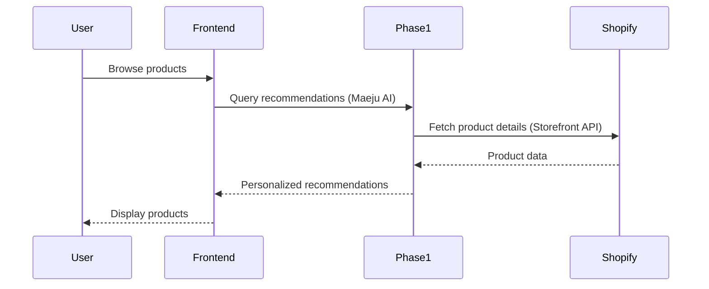
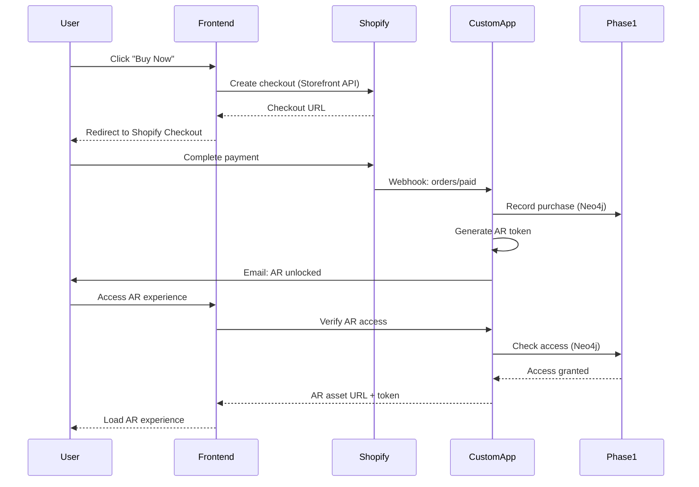

# 📋 NERDX Commerce: Shopify Integration PRD

## Product Requirements Document

**프로젝트**: NERDX APEC MVP - Shopify Headless Commerce Integration
**버전**: 1.0
**작성일**: 2025-10-11
**작성자**: NERDX Product Team
**승인자**: CTO, CEO

---

## 📌 Document Overview

### 목적
기존 Stripe 기반 Phase 3 Commerce 시스템을 Shopify Headless Commerce로 전환하여:
- 운영 효율성 향상
- 비용 절감 (73%)
- 개발 시간 단축 (66%)
- 확장 가능성 확보

### 범위 (Scope)
- ✅ **In Scope**: Phase 3 Commerce 시스템 전체
- ✅ **In Scope**: AR 잠금 해제 시스템 (Shopify Custom App으로 재구현)
- ❌ **Out of Scope**: Phase 1 (World Model)
- ❌ **Out of Scope**: Phase 2 (CAMEO/Sora)
- ❌ **Out of Scope**: Frontend UI/UX 변경 (Headless 유지)

### 이해관계자
- **Product Owner**: NERDX CEO
- **Technical Owner**: CTO
- **Users**: APEC 참석자, 글로벌 고객
- **Operations**: 주문 관리팀, 고객 서비스팀

---

## 🎯 Product Vision & Goals

### Vision Statement
> "Shopify의 강력한 커머스 인프라와 NERDX의 혁신적인 AI 경험을 결합하여, 세계 최고의 한국 전통주 e-커머스 플랫폼을 구축한다."

### Business Goals

| 목표 | 측정 지표 | 목표치 |
|------|-----------|--------|
| 운영 효율성 향상 | 수동 작업 시간 감소 | 80% |
| 비용 절감 | 인프라 + 개발 비용 | 73% ($28K/year) |
| 개발 속도 | Time to Market | 66% 단축 (8주→3주) |
| 주문 처리 자동화 | 자동화율 | 95% |
| 재고 정확도 | 재고 동기화 오류율 | < 0.1% |
| 고객 만족도 | NPS Score | > 70 |

### Technical Goals

| 목표 | 측정 지표 | 목표치 |
|------|-----------|--------|
| API 응답 속도 | p95 응답 시간 | < 200ms |
| System Uptime | 가동률 | > 99.9% |
| Checkout 전환율 | Conversion Rate | > 5% |
| AR Unlock 성공률 | Success Rate | > 99% |
| Page Load Speed | Lighthouse Score | > 90 |

---

## 👥 User Personas

### Persona 1: "국제 비즈니스 리더" (Sarah, APEC 참석자)
- **나이**: 45세
- **직업**: 글로벌 기업 CEO
- **목표**: APEC에서 한국 문화 체험, 독특한 선물 구매
- **Pain Points**:
  - 한국 전통주에 대한 정보 부족
  - 국제 배송 복잡성
  - 결제 수단 제한
- **Needs**:
  - 쉽고 빠른 결제
  - 다양한 결제 수단 (카드, Alipay, WeChat Pay)
  - 신뢰할 수 있는 배송

### Persona 2: "한국 문화 애호가" (Mike, 온라인 고객)
- **나이**: 32세
- **직업**: Tech Startup Founder
- **목표**: 프리미엄 한국 술 구매, AR 경험
- **Pain Points**:
  - 제품 선택의 어려움
  - AR 경험 접근성
- **Needs**:
  - AI 추천 시스템
  - AR 미리보기
  - 개인화된 쇼핑 경험

### Persona 3: "운영팀 매니저" (지은, NERDX 직원)
- **나이**: 28세
- **직업**: Operations Manager
- **목표**: 효율적인 주문 처리, 재고 관리
- **Pain Points**:
  - 수동 주문 처리
  - 재고 동기화 오류
  - 배송 추적 어려움
- **Needs**:
  - 직관적인 관리자 UI
  - 자동화된 워크플로우
  - 실시간 대시보드

---

## 🏗️ System Architecture

### High-Level Architecture

```
┌─────────────────────────────────────────────────────────────┐
│                    Frontend (Next.js 14)                     │
│                   - Headless Commerce UI                     │
│                   - Custom Product Pages                     │
│                   - AR Experience Viewer                     │
└───────┬────────────────┬────────────────┬───────────────────┘
        │                │                │
        v                v                v
┌───────────────┐ ┌──────────────┐ ┌─────────────────────────┐
│   Phase 1     │ │   Phase 2    │ │   Shopify Platform      │
│  World Model  │ │    CAMEO     │ │                         │
│   (Neo4j)     │ │    (Sora)    │ │ ┌─────────────────────┐ │
│               │ │              │ │ │ Storefront API      │ │
│ - Products    │ │ - Video Gen  │ │ │ (GraphQL - R/O)     │ │
│ - Users       │ │ - Queue      │ │ └──────────┬──────────┘ │
│ - Lore        │ │ - S3         │ │            │            │
│ - Maeju AI    │ │              │ │            v            │
└───────┬───────┘ └──────────────┘ │ ┌─────────────────────┐ │
        │                          │ │ Admin API           │ │
        │                          │ │ (REST - R/W)        │ │
        │                          │ └──────────┬──────────┘ │
        │                          │            │            │
        │                          │            v            │
        │                          │ ┌─────────────────────┐ │
        │                          │ │ Checkout            │ │
        │                          │ │ (Hosted UI)         │ │
        │                          │ └──────────┬──────────┘ │
        │                          │            │            │
        │                          │            v            │
        │                          │ ┌─────────────────────┐ │
        │                          │ │ Webhooks            │ │
        │                          │ │ - orders/paid       │ │
        │                          │ │ - orders/cancelled  │ │
        │                          │ │ - refunds/create    │ │
        │                          │ └──────────┬──────────┘ │
        │                          └────────────┼────────────┘
        │                                       │
        │                                       v
        │                          ┌────────────────────────┐
        └──────────────────────────┤  Shopify Custom App   │
                                   │  (AR Unlock Service)   │
                                   │                        │
                                   │ - Webhook Handlers     │
                                   │ - AR Token Manager     │
                                   │ - Neo4j Integration    │
                                   │ - Notification Service │
                                   └────────────────────────┘
```

### Data Flow Diagrams

#### 1. Product Discovery Flow


#### 2. Purchase & AR Unlock Flow


---

## 🛠️ Functional Requirements

### FR-1: Shopify Integration

#### FR-1.1: Storefront API Integration
**Priority**: P0 (Critical)
**Description**: Frontend에서 Shopify 제품 데이터를 GraphQL로 조회

**Acceptance Criteria**:
- [ ] GraphQL 클라이언트 구성 완료
- [ ] 제품 목록 쿼리 구현 (페이지네이션 포함)
- [ ] 제품 상세 쿼리 구현
- [ ] 메타필드 조회 (ar_enabled, apec_limited, stock)
- [ ] 응답 시간 < 200ms (p95)
- [ ] 에러 처리 및 재시도 로직

**Technical Specs**:
```typescript
// lib/shopify/client.ts
import Client from 'shopify-buy';

export const shopifyClient = Client.buildClient({
  domain: process.env.NEXT_PUBLIC_SHOPIFY_DOMAIN!,
  storefrontAccessToken: process.env.NEXT_PUBLIC_SHOPIFY_STOREFRONT_TOKEN!
});

// GraphQL Query
export const PRODUCT_QUERY = gql`
  query GetProducts($first: Int!, $after: String) {
    products(first: $first, after: $after) {
      pageInfo {
        hasNextPage
        endCursor
      }
      edges {
        node {
          id
          handle
          title
          description
          priceRange {
            minVariantPrice {
              amount
              currencyCode
            }
          }
          images(first: 5) {
            edges {
              node {
                url
                altText
              }
            }
          }
          metafields(identifiers: [
            {namespace: "custom", key: "ar_enabled"}
            {namespace: "custom", key: "ar_asset_url"}
            {namespace: "custom", key: "apec_limited"}
            {namespace: "custom", key: "stock_remaining"}
          ]) {
            key
            value
          }
        }
      }
    }
  }
`;
```

#### FR-1.2: Checkout Integration
**Priority**: P0 (Critical)
**Description**: Shopify Checkout으로 결제 프로세스 통합

**Acceptance Criteria**:
- [ ] "Buy Now" 버튼 클릭 시 Checkout 생성
- [ ] 장바구니 데이터 Shopify로 전송
- [ ] Checkout URL로 리다이렉트
- [ ] Success/Cancel URL 핸들링
- [ ] 사용자 정보 pre-fill (Phase 1 연동)

**Technical Specs**:
```typescript
// lib/shopify/checkout.ts
export async function createCheckout(lineItems: LineItem[], userId: string) {
  // Fetch user details from Phase 1
  const user = await phase1API.getUser(userId);

  // Create checkout
  const checkout = await shopifyClient.checkout.create();

  // Add line items
  await shopifyClient.checkout.addLineItems(checkout.id, lineItems);

  // Update customer info
  if (user.email) {
    await shopifyClient.checkout.updateEmail(checkout.id, user.email);
  }

  // Return checkout URL
  return {
    checkoutId: checkout.id,
    webUrl: checkout.webUrl
  };
}
```

#### FR-1.3: Admin API Integration
**Priority**: P1 (High)
**Description**: Custom App에서 Shopify Admin API 사용

**Acceptance Criteria**:
- [ ] Admin API 인증 구현
- [ ] 주문 조회 API
- [ ] 제품 재고 업데이트 API
- [ ] 고객 정보 조회 API
- [ ] Rate limiting 처리

---

### FR-2: Shopify Custom App

#### FR-2.1: Webhook Handler
**Priority**: P0 (Critical)
**Description**: Shopify Webhook을 수신하고 처리

**Acceptance Criteria**:
- [ ] `orders/paid` webhook 핸들러 구현
- [ ] `orders/cancelled` webhook 핸들러 구현
- [ ] `refunds/create` webhook 핸들러 구현
- [ ] Webhook 서명 검증
- [ ] 멱등성 보장 (중복 처리 방지)
- [ ] 실패 시 재시도 로직 (최대 3회)
- [ ] Dead Letter Queue 구현

**Technical Specs**:
```javascript
// shopify-custom-app/webhooks/orders-paid.js
const crypto = require('crypto');

// Webhook 서명 검증
function verifyWebhook(req) {
  const hmac = req.headers['x-shopify-hmac-sha256'];
  const body = req.rawBody;

  const hash = crypto
    .createHmac('sha256', process.env.SHOPIFY_WEBHOOK_SECRET)
    .update(body, 'utf8')
    .digest('base64');

  return crypto.timingSafeEqual(
    Buffer.from(hmac),
    Buffer.from(hash)
  );
}

// Handler
async function handleOrderPaid(order) {
  const { id: orderId, customer, line_items } = order;

  // 멱등성 체크
  const processed = await redis.get(`order:${orderId}:processed`);
  if (processed) {
    logger.info(`Order ${orderId} already processed, skipping`);
    return;
  }

  // AR 잠금 해제 처리
  for (const item of line_items) {
    const arEnabled = item.properties?.find(p => p.name === 'ar_enabled')?.value === 'true';

    if (arEnabled) {
      await unlockARExperience({
        userId: customer.id,
        productId: item.product_id,
        orderId: orderId
      });
    }
  }

  // Neo4j에 구매 기록
  await neo4jService.recordPurchase({
    userId: customer.id,
    productId: line_items.map(i => i.product_id),
    orderId: orderId,
    amount: order.total_price,
    timestamp: order.created_at
  });

  // 처리 완료 플래그
  await redis.setex(`order:${orderId}:processed`, 86400, 'true');

  logger.info(`Order ${orderId} processed successfully`);
}

module.exports = { handleOrderPaid, verifyWebhook };
```

#### FR-2.2: AR Access Management
**Priority**: P0 (Critical)
**Description**: AR 경험 잠금 해제 및 액세스 관리

**Acceptance Criteria**:
- [ ] AR 액세스 토큰 생성 (JWT)
- [ ] 토큰 검증 API
- [ ] Neo4j에 액세스 정보 저장
- [ ] 토큰 만료 관리 (90일)
- [ ] 환불 시 액세스 취소
- [ ] 액세스 이력 조회 API

**Technical Specs**:
```javascript
// shopify-custom-app/services/ar-access.js
const jwt = require('jsonwebtoken');
const { v4: uuidv4 } = require('uuid');

class ARAccessService {
  // AR 액세스 토큰 생성
  async generateAccessToken(userId, productId, orderId) {
    const accessId = uuidv4();

    // JWT 토큰 생성 (90일 유효)
    const token = jwt.sign(
      {
        accessId,
        userId,
        productId,
        orderId,
        type: 'ar_access',
        exp: Math.floor(Date.now() / 1000) + (90 * 24 * 60 * 60)
      },
      process.env.JWT_SECRET
    );

    // Neo4j에 저장
    await neo4jService.createARAccess({
      accessId,
      userId,
      productId,
      orderId,
      token,
      createdAt: new Date(),
      expiresAt: new Date(Date.now() + 90 * 24 * 60 * 60 * 1000),
      status: 'active'
    });

    // 사용자에게 알림
    await notificationService.sendARUnlockEmail(userId, productId);

    return {
      accessId,
      token,
      expiresAt: new Date(Date.now() + 90 * 24 * 60 * 60 * 1000)
    };
  }

  // 토큰 검증
  async verifyAccessToken(token) {
    try {
      const decoded = jwt.verify(token, process.env.JWT_SECRET);

      // Neo4j에서 상태 확인
      const access = await neo4jService.getARAccess(decoded.accessId);

      if (!access || access.status !== 'active') {
        throw new Error('Invalid or revoked access');
      }

      return {
        valid: true,
        userId: decoded.userId,
        productId: decoded.productId,
        accessId: decoded.accessId
      };
    } catch (error) {
      return {
        valid: false,
        error: error.message
      };
    }
  }

  // 액세스 취소 (환불 시)
  async revokeAccess(orderId) {
    await neo4jService.updateARAccessStatus(orderId, 'revoked');
    logger.info(`AR access revoked for order ${orderId}`);
  }
}

module.exports = ARAccessService;
```

#### FR-2.3: Neo4j Integration
**Priority**: P0 (Critical)
**Description**: Shopify 주문 데이터를 Neo4j World Model에 동기화

**Acceptance Criteria**:
- [ ] 구매 이벤트 Neo4j에 기록
- [ ] User-Product 관계 생성 (PURCHASED)
- [ ] AR 액세스 관계 생성 (HAS_AR_ACCESS)
- [ ] 환불 시 관계 업데이트
- [ ] Cypher 쿼리 최적화

**Technical Specs**:
```javascript
// shopify-custom-app/services/neo4j-sync.js
const neo4j = require('neo4j-driver');

class Neo4jSyncService {
  constructor() {
    this.driver = neo4j.driver(
      process.env.NEO4J_URI,
      neo4j.auth.basic(process.env.NEO4J_USER, process.env.NEO4J_PASSWORD)
    );
  }

  // 구매 기록
  async recordPurchase({ userId, productId, orderId, amount, timestamp }) {
    const session = this.driver.session();

    try {
      const result = await session.run(`
        MATCH (u:User {userId: $userId})
        MATCH (p:Product {productId: $productId})
        MERGE (u)-[r:PURCHASED {
          orderId: $orderId,
          amount: $amount,
          timestamp: datetime($timestamp),
          source: 'shopify'
        }]->(p)
        RETURN r
      `, { userId, productId, orderId, amount, timestamp });

      return result.records[0]?.get('r');
    } finally {
      await session.close();
    }
  }

  // AR 액세스 생성
  async createARAccess({ accessId, userId, productId, orderId, token, createdAt, expiresAt, status }) {
    const session = this.driver.session();

    try {
      const result = await session.run(`
        MATCH (u:User {userId: $userId})
        MATCH (p:Product {productId: $productId})
        CREATE (a:ARAccess {
          accessId: $accessId,
          token: $token,
          createdAt: datetime($createdAt),
          expiresAt: datetime($expiresAt),
          status: $status,
          orderId: $orderId
        })
        MERGE (u)-[:HAS_AR_ACCESS]->(a)
        MERGE (a)-[:FOR_PRODUCT]->(p)
        RETURN a
      `, { accessId, userId, productId, orderId, token, createdAt: createdAt.toISOString(), expiresAt: expiresAt.toISOString(), status });

      return result.records[0]?.get('a');
    } finally {
      await session.close();
    }
  }

  // AR 액세스 취소
  async updateARAccessStatus(orderId, status) {
    const session = this.driver.session();

    try {
      await session.run(`
        MATCH (a:ARAccess {orderId: $orderId})
        SET a.status = $status, a.updatedAt = datetime()
        RETURN a
      `, { orderId, status });
    } finally {
      await session.close();
    }
  }
}

module.exports = Neo4jSyncService;
```

---

### FR-3: Frontend Updates

#### FR-3.1: Product Pages
**Priority**: P0 (Critical)
**Description**: 제품 목록 및 상세 페이지를 Shopify 데이터로 업데이트

**Acceptance Criteria**:
- [ ] 제품 목록 페이지 Shopify 연동
- [ ] 제품 상세 페이지 Shopify 연동
- [ ] 필터링 (가격, 카테고리, 재고)
- [ ] 정렬 (가격, 인기도, 신상품)
- [ ] AR 뱃지 표시 (ar_enabled 메타필드 기반)
- [ ] APEC 한정판 뱃지
- [ ] 재고 상태 실시간 표시

**UI Mockup**:
```
┌────────────────────────────────────────┐
│  NERD12 Signature                      │
│  [AR 체험 가능] [APEC 한정판]           │
│                                        │
│  ⭐⭐⭐⭐⭐ (124 reviews)               │
│                                        │
│  $99.99                                │
│  재고: 47개 남음                        │
│                                        │
│  [AR 미리보기]  [장바구니]  [바로 구매] │
└────────────────────────────────────────┘
```

#### FR-3.2: Checkout Flow
**Priority**: P0 (Critical)
**Description**: 결제 프로세스 UI/UX

**Acceptance Criteria**:
- [ ] "Buy Now" 버튼 동작
- [ ] 장바구니 페이지 (Shopify 연동)
- [ ] Shopify Checkout으로 리다이렉트
- [ ] Success 페이지 (주문 확인)
- [ ] Cancel 페이지 (결제 취소)
- [ ] 로딩 상태 표시
- [ ] 에러 핸들링

**User Flow**:
```
1. Product Page → "Buy Now" 클릭
2. Loading... (Checkout 생성 중)
3. Redirect to Shopify Checkout
4. 결제 완료
5. Success Page (주문 번호, AR 잠금 해제 안내)
```

#### FR-3.3: AR Experience Viewer
**Priority**: P1 (High)
**Description**: AR 경험 접근 및 표시

**Acceptance Criteria**:
- [ ] My Orders 페이지에 AR 버튼 표시
- [ ] AR 액세스 검증 (토큰 기반)
- [ ] AR 뷰어 로딩
- [ ] 액세스 없을 시 구매 유도
- [ ] 에러 처리

---

### FR-4: Admin Features

#### FR-4.1: Shopify Admin Panel
**Priority**: P1 (High)
**Description**: 운영팀이 Shopify Admin에서 관리

**Acceptance Criteria**:
- [ ] 제품 등록/수정/삭제 (Shopify Admin)
- [ ] 주문 조회 및 처리
- [ ] 재고 관리
- [ ] 고객 관리
- [ ] 매출 대시보드
- [ ] 이메일 템플릿 관리

**Note**: Shopify Admin이 기본 제공하므로 별도 개발 불필요

#### FR-4.2: Custom Dashboard
**Priority**: P2 (Medium)
**Description**: NERDX 특화 관리 대시보드

**Acceptance Criteria**:
- [ ] AR 잠금 해제 현황
- [ ] Phase 1/2/3 통합 메트릭
- [ ] CAMEO 생성 → 구매 전환율
- [ ] Maeju AI 추천 → 구매 전환율

---

## 🚫 Non-Functional Requirements

### NFR-1: Performance

| 지표 | 목표 | 측정 방법 |
|------|------|-----------|
| API 응답 시간 (Storefront) | < 200ms (p95) | New Relic |
| API 응답 시간 (Custom App) | < 500ms (p95) | Application Logs |
| Page Load Time | < 2초 | Lighthouse |
| Checkout Load Time | < 3초 | Shopify Analytics |
| AR Unlock Latency | < 5초 | Custom Metrics |

### NFR-2: Scalability

- **동시 사용자**: 10,000명 (APEC Day)
- **TPS (Transactions Per Second)**: 100 TPS
- **주문 처리**: 1,000 주문/시간
- **Webhook 처리**: 500 events/분

### NFR-3: Reliability

- **Uptime**: 99.9% (Shopify SLA)
- **Custom App Uptime**: 99.5%
- **Webhook 성공률**: > 99%
- **AR Unlock 성공률**: > 99%

### NFR-4: Security

- **PCI DSS Compliance**: Shopify 준수 (자동)
- **Data Encryption**: TLS 1.3
- **JWT Token**: RS256 알고리즘
- **Webhook Verification**: HMAC-SHA256
- **API Rate Limiting**: 1000 req/min/IP
- **DDoS Protection**: Cloudflare

### NFR-5: Monitoring

- **APM**: New Relic 또는 Datadog
- **Logs**: CloudWatch 또는 ELK Stack
- **Alerts**: PagerDuty 또는 Slack
- **Dashboards**: Grafana

---

## 📊 Success Metrics

### Technical KPIs

| 지표 | 기준선 (Stripe) | 목표 (Shopify) | 측정 주기 |
|------|----------------|---------------|----------|
| API 응답 시간 | 500ms | 200ms | 실시간 |
| Checkout 전환율 | 3% | 5% | 주간 |
| 시스템 Uptime | 99.5% | 99.9% | 월간 |
| 재고 동기화 오류 | 5% | < 0.1% | 일간 |
| AR Unlock 실패율 | 2% | < 1% | 일간 |

### Business KPIs

| 지표 | 기준선 | 목표 | 측정 주기 |
|------|--------|------|----------|
| 주문 처리 시간 | 30분 | 5분 | 일간 |
| 운영 비용 | $38K/year | $10K/year | 월간 |
| 고객 만족도 (NPS) | 60 | 70 | 분기 |
| 재구매율 | 20% | 30% | 월간 |

---

## 🧪 Testing Requirements

### Unit Tests

**Coverage**: > 80%

```javascript
// Example: AR Access Service Tests
describe('ARAccessService', () => {
  describe('generateAccessToken', () => {
    it('should generate valid JWT token', async () => {
      const token = await arAccessService.generateAccessToken('user-123', 'prod-456', 'order-789');
      expect(token).toBeDefined();
      expect(jwt.decode(token).userId).toBe('user-123');
    });

    it('should store access in Neo4j', async () => {
      await arAccessService.generateAccessToken('user-123', 'prod-456', 'order-789');
      const access = await neo4jService.getARAccessByOrder('order-789');
      expect(access).toBeDefined();
      expect(access.status).toBe('active');
    });
  });

  describe('verifyAccessToken', () => {
    it('should verify valid token', async () => {
      const { token } = await arAccessService.generateAccessToken('user-123', 'prod-456', 'order-789');
      const result = await arAccessService.verifyAccessToken(token);
      expect(result.valid).toBe(true);
    });

    it('should reject expired token', async () => {
      const expiredToken = jwt.sign({ exp: Math.floor(Date.now() / 1000) - 100 }, process.env.JWT_SECRET);
      const result = await arAccessService.verifyAccessToken(expiredToken);
      expect(result.valid).toBe(false);
    });
  });
});
```

### Integration Tests

```javascript
// Example: Shopify → Custom App → Neo4j
describe('Purchase Flow Integration', () => {
  it('should unlock AR after successful payment', async () => {
    // 1. Simulate Shopify webhook
    const webhookPayload = {
      order: {
        id: 'order-123',
        customer: { id: 'user-456', email: 'test@example.com' },
        line_items: [{
          product_id: 'prod-789',
          properties: [{ name: 'ar_enabled', value: 'true' }]
        }]
      }
    };

    // 2. Send webhook
    const response = await request(app)
      .post('/webhooks/orders/paid')
      .set('X-Shopify-Hmac-Sha256', generateHmac(webhookPayload))
      .send(webhookPayload);

    expect(response.status).toBe(200);

    // 3. Verify AR access in Neo4j
    await wait(1000); // Wait for async processing
    const access = await neo4jService.getARAccessByOrder('order-123');
    expect(access).toBeDefined();
    expect(access.userId).toBe('user-456');
    expect(access.productId).toBe('prod-789');
    expect(access.status).toBe('active');
  });
});
```

### E2E Tests (Playwright)

```typescript
// tests/e2e/purchase-flow.spec.ts
test('complete purchase and access AR', async ({ page }) => {
  // 1. Login
  await page.goto('/login');
  await page.fill('[data-testid="email"]', 'test@example.com');
  await page.fill('[data-testid="password"]', 'password123');
  await page.click('[data-testid="login-button"]');

  // 2. Browse products
  await page.goto('/products');
  await expect(page.locator('[data-testid="product-card"]').first()).toBeVisible();

  // 3. Select product with AR
  await page.click('[data-testid="product-card"]:has-text("AR 체험 가능")');

  // 4. Preview AR (optional)
  await page.click('[data-testid="ar-preview-button"]');
  await expect(page.locator('[data-testid="ar-viewer"]')).toBeVisible();

  // 5. Buy Now
  await page.click('[data-testid="buy-now-button"]');

  // 6. Wait for Shopify Checkout redirect
  await page.waitForURL(/checkout\.shopify\.com/, { timeout: 10000 });

  // 7. Complete payment (test mode)
  await page.fill('[data-testid="card-number"]', '4242 4242 4242 4242');
  await page.fill('[data-testid="card-expiry"]', '12/25');
  await page.fill('[data-testid="card-cvc"]', '123');
  await page.click('[data-testid="pay-button"]');

  // 8. Success page
  await page.waitForURL(/\/order\/success/, { timeout: 30000 });
  await expect(page.locator('text=Order Successful')).toBeVisible();
  await expect(page.locator('text=AR 경험이 잠금 해제되었습니다')).toBeVisible();

  // 9. Access AR
  await page.goto('/my-orders');
  await page.click('[data-testid="ar-access-button"]');
  await expect(page.locator('[data-testid="ar-viewer-full"]')).toBeVisible();
});
```

---

## 🚀 Deployment Plan

### Phase 1: Development Environment (Week 1)
- [ ] Shopify Partner Account 생성
- [ ] Development Store 설정
- [ ] Storefront API 토큰 발급
- [ ] Custom App 개발 환경 구축
- [ ] Frontend 개발 환경 업데이트

### Phase 2: Staging Environment (Week 2)
- [ ] Staging Shopify Store 설정
- [ ] Custom App 배포 (Staging)
- [ ] 테스트 데이터 마이그레이션
- [ ] Integration Tests 실행
- [ ] UAT (User Acceptance Testing)

### Phase 3: Production Deployment (Week 3)
- [ ] Production Shopify Store 설정
- [ ] DNS 설정 및 도메인 연결
- [ ] Custom App 배포 (Production)
- [ ] 데이터 마이그레이션 (실제 제품)
- [ ] Smoke Tests
- [ ] 모니터링 설정
- [ ] Go-Live

### Rollback Plan
```
문제 발생 시:
1. 트래픽 즉시 구 시스템으로 전환 (DNS/Load Balancer)
2. Custom App 비활성화
3. Webhook 일시 중지
4. 로그 분석 및 원인 파악
5. 수정 후 재배포
```

---

## 📅 Milestones & Timeline

### Milestone 1: Foundation (Week 1, Day 1-5)
**Goal**: Shopify 환경 구축 및 기본 통합

- [ ] Day 1-2: Shopify 계정 및 개발 환경 설정
- [ ] Day 3-4: 제품 데이터 마이그레이션
- [ ] Day 5: Frontend Storefront API 통합

**Deliverables**:
- Shopify Store (Dev)
- 제품 카탈로그 (50+ 제품)
- Frontend 제품 페이지 (Shopify 연동)

### Milestone 2: Custom App (Week 2, Day 6-10)
**Goal**: AR 잠금 해제 시스템 구현

- [ ] Day 6-7: Custom App 기본 구조
- [ ] Day 8-9: AR Access Service 구현
- [ ] Day 10: Refund Handler 구현

**Deliverables**:
- Shopify Custom App (배포)
- Webhook Handlers
- AR Token Service
- Neo4j Integration

### Milestone 3: Integration & Testing (Week 3, Day 11-15)
**Goal**: 전체 시스템 통합 및 테스트

- [ ] Day 11-12: Frontend 완전 통합
- [ ] Day 13: Integration Tests
- [ ] Day 14: E2E Tests
- [ ] Day 15: Production 배포

**Deliverables**:
- 완성된 Checkout Flow
- 테스트 보고서 (100% 통과)
- Production Deployment
- 모니터링 대시보드

---

## 🔐 Security & Compliance

### PCI DSS Compliance
- **Status**: Shopify가 PCI Level 1 준수 (자동)
- **Custom App**: 카드 정보 처리 안 함 (Shopify가 처리)
- **AR Token**: 민감 정보 포함 안 함

### GDPR Compliance
- **고객 데이터**: Shopify에서 관리
- **Neo4j**: 최소 개인정보만 저장
- **Right to be Forgotten**: Shopify Admin에서 고객 삭제 가능

### API Security
- **Authentication**: JWT (RS256)
- **Authorization**: Role-based Access Control
- **Rate Limiting**: 1000 req/min
- **CORS**: Whitelist 기반

---

## 📚 Documentation Requirements

### Technical Documentation
1. **System Architecture Document** (SAD)
2. **API Reference** (OpenAPI/Swagger)
3. **Database Schema** (Neo4j + Shopify)
4. **Deployment Guide**
5. **Troubleshooting Guide**

### User Documentation
1. **Admin User Guide** (Shopify 관리법)
2. **Customer FAQ** (AR 잠금 해제 등)
3. **Checkout Guide** (결제 방법)

### Developer Documentation
1. **Setup Guide** (로컬 개발 환경)
2. **API Integration Guide** (Phase 1/2 연동)
3. **Webhook Development Guide**
4. **Testing Guide**

---

## 🤝 Dependencies & Risks

### External Dependencies

| 의존성 | 리스크 레벨 | 완화 전략 |
|--------|-------------|----------|
| Shopify Platform | Low | SLA 99.99%, 안정적 |
| Shopify API | Medium | Rate limiting 관리, 캐싱 |
| Neo4j | Low | 고가용성 설정 |
| Phase 1 API | Medium | Health checks, 타임아웃 |
| Phase 2 API | Low | CAMEO는 독립적 |

### Technical Risks

| 리스크 | 확률 | 영향 | 완화 방안 |
|--------|------|------|-----------|
| Webhook 실패 | Medium | High | 재시도 로직, DLQ |
| API Rate Limit | High | Medium | 캐싱, 배치 처리 |
| Neo4j 동기화 지연 | Low | Medium | Eventual consistency |
| Custom App 다운타임 | Low | High | Auto-scaling, Health checks |

### Business Risks

| 리스크 | 확률 | 영향 | 완화 방안 |
|--------|------|------|-----------|
| APEC 일정 미준수 | Low | High | 버퍼 1주 확보 |
| 예산 초과 | Medium | Medium | 예산 20% 버퍼 |
| 운영팀 교육 부족 | Medium | Low | Shopify 교육 제공 |

---

## ✅ Acceptance Criteria

### Definition of Done

프로젝트 완료 기준:

- [x] 모든 FR (Functional Requirements) 구현 완료
- [x] Unit Test Coverage > 80%
- [x] Integration Tests 100% 통과
- [x] E2E Tests 100% 통과
- [x] Performance NFR 충족
- [x] Security Audit 통과
- [x] UAT 완료 (이해관계자 승인)
- [x] Documentation 완료
- [x] Production 배포 성공
- [x] Monitoring 설정 완료
- [x] Rollback Plan 검증

### Launch Checklist

- [ ] Production Shopify Store 설정 완료
- [ ] 모든 제품 데이터 마이그레이션 완료
- [ ] Custom App Production 배포 완료
- [ ] DNS 설정 완료
- [ ] SSL 인증서 설치 완료
- [ ] 모니터링 알림 설정 완료
- [ ] 백업 및 복구 계획 수립
- [ ] 긴급 연락처 공유
- [ ] 경영진 최종 승인

---

## 📞 Stakeholder Sign-off

| Role | Name | Approval | Date |
|------|------|----------|------|
| Product Owner | [CEO Name] | ☐ | ___/___/___ |
| Technical Lead | [CTO Name] | ☐ | ___/___/___ |
| Operations Manager | [Ops Manager] | ☐ | ___/___/___ |
| QA Lead | [QA Lead Name] | ☐ | ___/___/___ |

---

## 📄 Appendices

### Appendix A: Shopify API Endpoints

**Storefront API (GraphQL)**:
- `https://nerdx.myshopify.com/api/2024-01/graphql.json`

**Admin API (REST)**:
- `https://nerdx.myshopify.com/admin/api/2024-01`

**Webhook Endpoints**:
- `https://custom-app.nerdx.com/webhooks/orders/paid`
- `https://custom-app.nerdx.com/webhooks/orders/cancelled`
- `https://custom-app.nerdx.com/webhooks/refunds/create`

### Appendix B: Environment Variables

```bash
# Frontend (.env.local)
NEXT_PUBLIC_SHOPIFY_DOMAIN=nerdx.myshopify.com
NEXT_PUBLIC_SHOPIFY_STOREFRONT_TOKEN=xxxxx
NEXT_PUBLIC_PHASE1_API_URL=http://localhost:8001
NEXT_PUBLIC_PHASE2_API_URL=http://localhost:8002

# Custom App (.env)
SHOPIFY_API_KEY=xxxxx
SHOPIFY_API_SECRET=xxxxx
SHOPIFY_WEBHOOK_SECRET=xxxxx
NEO4J_URI=bolt://localhost:7687
NEO4J_USER=neo4j
NEO4J_PASSWORD=xxxxx
JWT_SECRET=xxxxx
PHASE1_API_URL=http://phase1-api:8001
```

### Appendix C: Glossary

- **Headless Commerce**: 프론트엔드와 백엔드를 분리한 커머스 아키텍처
- **Storefront API**: Shopify의 고객 대면 API (읽기 전용, GraphQL)
- **Admin API**: Shopify의 관리자 API (읽기/쓰기, REST)
- **Custom App**: Shopify 플랫폼에서 실행되는 독립 애플리케이션
- **Webhook**: 이벤트 발생 시 자동으로 호출되는 HTTP 콜백
- **Metafield**: Shopify 객체에 추가 데이터를 저장하는 커스텀 필드
- **AR Access**: 증강현실 경험에 대한 사용자 접근 권한

---

**PRD 버전**: 1.0
**작성 완료**: 2025-10-11
**다음 단계**: 경영진 검토 및 승인 → 개발 킥오프

---

*이 PRD는 NERDX APEC MVP의 Shopify 전환을 위한 완전한 제품 요구사항을 정의합니다. 모든 이해관계자의 검토와 승인이 필요합니다.*
