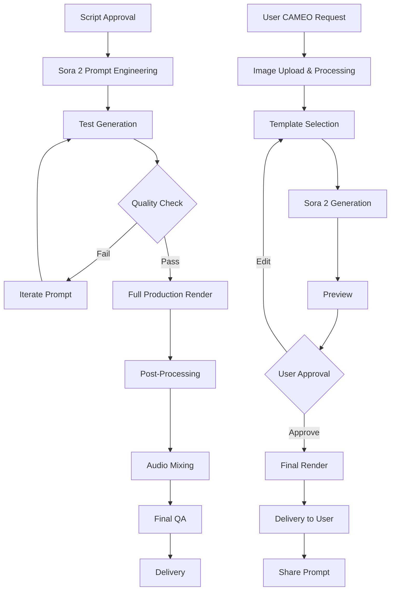

# NERDX x APEC: Sora 2 Prompts Library

## 📋 프롬프트 설계 원칙

### Sora 2 최적화 가이드라인
1. **물리적 정확성**: 실제 물리법칙 준수 (액체의 흐름, 빛의 반사 등)
2. **시간적 일관성**: 여러 샷에 걸쳐 캐릭터/배경 일관성 유지
3. **감성적 톤**: 브랜드 정체성 반영 (따뜻함, 혁신, 전통과 현대의 조화)
4. **카메라 워크**: 영화적 기법 명시 (dolly, crane, handheld 등)
5. **조명**: 시간대와 분위기 구체적으로 지정

---

## 🎬 Phase 1: 티저 콘텐츠 Prompts

### Prompt 1.1: "Sam's Mysterious Package"
```
[Sora 2 Prompt - Duration: 20 seconds]

SCENE SETTING:
Modern minimalist office in San Francisco, golden hour lighting streaming through floor-to-ceiling windows. Warm, inviting atmosphere.

CAMERA:
Start with a slow dolly-in shot from medium to close-up. Smooth, cinematic movement. 24fps for film-like quality.

ACTION SEQUENCE:
- A sleek black package with subtle Korean pattern (mother-of-pearl inlay style) sits on a wooden desk
- Hands (masculine, professional) carefully unwrap the package
- Reveal: Premium NERD12 bottle with iridescent holographic label
- As fingers touch the label, it shimmers and glows with soft AR-like effect
- Holographic light particles rise from the bottle, forming Korean characters "즐거움" (Joy)
- Characters morph into English "DISCOVER KOREAN JOY"

VISUAL STYLE:
- Color grading: Warm with teal shadows (cinematic look)
- Bokeh depth-of-field on background
- Product hyper-realistic with slight glow
- Particle effects: Soft, magical, not overly CG
- Reference: Apple product reveal aesthetic meets Korean traditional art

AUDIO CUES (for music sync):
- Gentle gayageum pluck when package opens
- Ambient electronic undertones
- Soft whoosh for holographic reveal

TEXT OVERLAY (appears at end):
"An invitation from Korea"
"October 2025 | APEC CEO Summit"
"With Sam Altman & OpenAI Sora"
```

---

### Prompt 1.2: "Portal to Korea"
```
[Sora 2 Prompt - Duration: 30 seconds]

SCENE TRANSITION (Morphing sequence):

PART 1 (0-10s):
Camera slowly zooms into the NERD12 bottle label. The holographic Korean pattern begins to animate, expanding to fill the frame.

PART 2 (10-20s):
Pattern transforms into a portal/tunnel effect. Camera "travels through" the pattern, which evolves from modern digital to traditional Korean tile mosaic (dancheong colors: blue, red, green, yellow).

PART 3 (20-30s):
Emerge from the portal into a breathtaking scene:
- Traditional Hanok village (Bukchon style) at twilight
- Paper lanterns glowing warmly
- In the foreground: Traditional brewery with large clay jars (hangari)
- In the background: Modern Seoul skyline (Lotte Tower, Gangnam) visible but softly blurred
- AR elements floating subtly: digital cherry blossoms, light particles

CAMERA:
Single continuous shot (oner). Starts as dolly-in, becomes a travel/fly-through, ends as crane-up reveal shot.

LIGHTING:
Blue hour (civil twilight) - that magical moment when traditional lanterns and modern city lights are both visible. Warm practical lights (lanterns) vs cool ambient twilight.

MOOD:
Wonder, invitation, cultural depth meets innovation. Should feel like stepping into a beautiful secret.

ENDING:
Fade to text: "Sam Altman's Korean Joy Journey / Coming October 2025"
```

---

## 🎬 Phase 2: 메인 콘텐츠 Prompts

### Prompt 2.1: "Sam at the Brewery" (Scene 1)
```
[Sora 2 Prompt - Duration: 45 seconds]

CHARACTER INPUT:
[CAMEO Feature] Sam Altman reference images uploaded. Maintain facial features, casual professional attire (dark t-shirt, jeans), friendly demeanor.

SCENE:
Interior of 100-year-old Korean brewery. Rustic wooden beams, clay walls, rows of traditional fermentation jars. Soft diffused natural light from paper windows (hanji). Dust particles visible in light rays.

SEQUENCE:

Shot 1 (0-10s):
- Wide shot: Sam walking between rows of fermentation jars with elderly Korean master brewer (한복 wearing, kind face)
- Camera: Slow lateral tracking shot
- Sam gently touches a jar, looking curious and respectful
- Master brewer explains with animated gestures

Shot 2 (10-20s):
- Medium two-shot: Master brewer opens a jar
- Close-up insert: Bubbling makgeolli fermentation
- Sam's face (close-up): Expression of wonder
- VISUAL EFFECT: Subtle overlay of AI neural network pattern (like GPT training visualization) mirroring the fermentation bubbles

Shot 3 (20-30s):
- Over-shoulder shot of Sam
- Master pours fresh makgeolli into a traditional bowl
- Sam tastes, nods appreciatively
- SPLIT SCREEN effect (non-intrusive): Left shows traditional process, Right shows modern NERD facility with similar fermentation in stainless steel

Shot 4 (30-45s):
- Close-up: Sam's face
- He says (if audio sync possible, otherwise text): "This is like training GPT... layers of complexity, time, and tradition... but delicious"
- Camera slowly pushes in for emotional intimacy
- Warm smile, genuine connection moment

STYLE:
Documentary meets commercial. Authentic, not overly polished. Respect for tradition. Terrence Malick-style light and composition but more accessible.

COLOR:
Warm wood tones, earthy clay, soft white (makgeolli), golden light.
```

---

### Prompt 2.2: "NERD Innovation Lab" (Scene 2)
```
[Sora 2 Prompt - Duration: 40 seconds]

LOCATION:
Modern food-tech facility. Clean, minimalist design with touches of Korean aesthetic (wooden accents, hanji-inspired lighting panels). Large windows showing Seoul cityscape.

LIGHTING:
Bright, clean, but not sterile. Soft shadows. Mix of natural light and modern LED. Blue-white color temperature but balanced with warm accents.

SEQUENCE:

Shot 1 (0-10s):
- Sam enters frame from left, walking into a tasting area
- Sleek white table with organized row of NERD products:
  * NERD12 Signature (prominent)
  * NERD SPRITZ varieties (3 bottles)
  * Tasting glasses
- Camera: Smooth dolly revealing the setup
- NERD team member (young, professional, Korean) greets Sam

Shot 2 (10-25s):
- Sam tastes NERD12
- HIS POV (subjective camera): As he tastes, the world transforms
- AR-style visualization appears:
  * Flavor profile wheel (floating hologram)
  * Ingredient origins map (Korean regions highlighted)
  * Tasting notes appearing as floating text
- Camera rotates 180° around Sam as these elements swirl
- VFX: High-end but grounded, not cartoony

Shot 3 (25-40s):
- Wide shot: Sam at a large touchscreen
- He inputs his taste preferences (touch interactions visible)
- Screen displays: "Generating Your Korean Joy Story..."
- Loading animation (elegant, branded)
- Sam looks at camera, slight smile: "Let's see what AI creates"

TONE:
Innovative yet approachable. Shows technology serving human experience, not replacing it.

PRODUCT HERO MOMENT:
NERD12 bottle must look premium, desirable. Glass texture, light refraction, label details all hyper-real.
```

---

### Prompt 2.3: "Sam's CAMEO Story" (Scene 3 - Meta Moment)
```
[Sora 2 Prompt - Duration: 60 seconds - This is THE centerpiece]

CONCEPT:
This is a "story within a story". We're showing what Sora generated FOR Sam. Korean folk tale aesthetic meets personal hero's journey.

STYLE REFERENCE:
Studio Ghibli meets Korean historical drama (사극) meets modern magical realism.

--- SAM'S GENERATED STORY BEGINS ---

Opening (0-5s):
- Parchment scroll unfurls, revealing painted Korean landscape
- Painting comes to life (2D to 3D transformation)
- Text brushstroke animation: "The Tale of the Wandering Scholar"

Act 1: The Quest (5-20s):
- Sam (in traditional Korean scholar's hanbok, but still recognizable) walking through misty mountain path
- Ancient Korean temple in the distance
- He carries a wooden chest
- Camera: Aerial drone shot descending to follow him
- Cherry blossoms fall (seasonal beauty)

Act 2: The Discovery (20-40s):
- Inside temple courtyard
- Sam meets three mystical guardians (stylized, fantasy elements):
  * Guardian of Rice (representing ingredients)
  * Guardian of Water (representing purity)
  * Guardian of Fire (representing distillation)
- They circle around him as he places the chest in the center
- He opens it: Glowing NERD12 bottle inside
- Guardians bow in approval
- Light emanates from the bottle, transforming the courtyard

Act 3: The Celebration (40-55s):
- Rapid montage to modern time
- Sam (back in contemporary clothes) in bustling Korean street food market
- People of all ages enjoying NERD products
- Cross-cultural moments: Sam sharing drinks with locals, laughter
- Korean grandmother offering him food, young tech workers toasting
- AR elements: Floating lanterns, digital cherry blossoms

Closing (55-60s):
- Pull back to reveal: This entire story is displayed on the lab screen
- Cut to real Sam watching his own story, amazed expression
- He looks at camera: "That's incredible"
- Screen shows: "Your turn. Create your Korean Joy story."

CRITICAL NOTES:
- Sam's digital double must be seamless, respectful, heroic
- Balance whimsy with sophistication
- Korean cultural elements must be authentic, not appropriative
- The "magic" is AI-powered personal storytelling, make that clear

MUSIC:
Traditional Korean orchestral (haegeum, daegeum, janggu) meets epic cinematic score. Think "Kingdom" (Netflix) soundtrack.
```

---

### Prompt 2.4: "Phygital Experience" (Scene 4)
```
[Sora 2 Prompt - Duration: 35 seconds]

LOCATION:
Nerd House Bukchon - Upscale Korean cocktail bar with traditional architecture and modern interior design.

TIME: Evening, intimate lighting.

SEQUENCE:

Shot 1 (0-12s):
- Sam sits at beautiful wooden bar
- Bartender (skilled, professional) prepares NERD cocktail
- Product placement: NERD SPRITZ bottle prominent
- Close-ups: Ice, garnish (Korean yuzu), pouring motion (slow-motion for 2 seconds)
- Physics accuracy: Liquid flow must be perfect

Shot 2 (12-25s):
- Sam picks up smartphone, points at NERD bottle on table
- AR activation effect (subtle glow around phone)
- HIS POV through phone screen:
  * Bottle label comes alive
  * Virtual sommelier "Joon" materializes (holographic Korean man, friendly, professional)
  * Joon gestures to the cocktail, info bubbles appear:
    - Tasting notes
    - Food pairing suggestions (floating mini images of Korean dishes)
    - "Tap to order ingredients"
- Sam taps, "Added to cart" confirmation

Shot 3 (25-35s):
- Wider shot: Other bar patrons also using AR features
- Various people (diverse, international APEC crowd) having "aha!" moments
- Subtle UI overlays showing different languages (English, Korean, Chinese)
- Warm, convivial atmosphere
- Sam raises glass in toast with people around him
- Unity in diversity, technology enabling human connection

MOOD:
Aspirational but achievable. "This is the future, and it's already here."

TECH REPRESENTATION:
AR must look polished but real (iPhone/Android capabilities), not sci-fi. Reference: Apple Vision Pro demos but more accessible.
```

---

### Prompt 2.5: "Community Moment" (Scene 5 - Finale)
```
[Sora 2 Prompt - Duration: 30 seconds]

CONCEPT:
Show the power of shared experience across cultures through AI-enabled connection.

SETTING:
Split between physical venue (Nerd House Bukchon) and virtual space (stylized, not full metaverse).

SEQUENCE:

Shot 1 (0-10s):
- Physical space: Sam with 20-30 people in beautiful Korean venue
- Everyone holding NERD products, mid-toast
- Diversity visible: Western business suits, Korean traditional modern (생활한복), casual attire
- Warm, golden lighting

Shot 2 (10-20s):
- AR overlay activates for everyone simultaneously
- Holographic "ghosts" of remote participants appear:
  * Someone in Tokyo
  * Someone in Singapore
  * Someone in San Francisco
  * All visible as translucent, well-designed holograms
- They're all part of the same toast
- UI shows: "#KoreanJoyWithNERDX - Live: 1,247 participants worldwide"

Shot 3 (20-30s):
- Camera pulls back to impossible angle (crane up and out)
- Reveals this is one of many simultaneous events around the world
- Visual: Earth from space with glowing connection points
- Zoom back down to Sam, center frame, genuine smile
- Text overlay: "Join the Korean Joy Movement"
- Final frame: NERDX logo + APEC 2025 + OpenAI Sora credit

EMOTIONAL BEAT:
This isn't about technology. It's about human joy, connection, shared culture. Technology is the enabler, not the hero.

VFX:
High-end but grounded. Must feel "near future" not distant sci-fi. Believable within 2025 context.

SOUND:
Crescendo. All the musical themes from previous scenes come together. Big, emotional, hopeful.
```

---

## 🎬 Phase 3: User CAMEO Templates

### Template A: "Traditional Tavern Adventure"
```
[Sora 2 CAMEO Prompt - Duration: 30 seconds]
[USER_FACE_INPUT + SAM_ALTMAN_DIGITAL_DOUBLE]

STORY:
User and Sam discover a hidden traditional Korean tavern (주막) in a modern Seoul alley.

SEQUENCE:
1. User walking down Gangnam street (modern), Sam appears beside them
2. Sam points to hidden door, winks
3. They enter together - world transforms to traditional 조선시대 tavern
4. Friendly tavern keeper (할머니) greets them, pours NERD12
5. They toast, environment bursts into color and celebration
6. Closing: Modern Seoul reappears, but they're holding NERD products

STYLE: Whimsical, magical realism, heartwarming

PERSONALIZATION VARIABLES:
- User's face seamlessly integrated
- User's name spoken by Sam (text-to-speech sync)
- User can select preferred NERD product to feature
```

---

### Template B: "Future K-Food Festival"
```
[Sora 2 CAMEO Prompt - Duration: 30 seconds]

STORY:
User and Sam attend a futuristic K-Food festival with holographic food stalls and AR experiences.

SEQUENCE:
1. Arrive at glowing entrance portal together
2. Walk through festival - floating food, AR menus, holographic K-pop performances
3. Stop at NERD booth - most impressive display
4. Virtual bartender creates custom cocktail for user
5. Sam and user clink glasses, confetti cannons
6. Text: "{USER_NAME} x Sam Altman - Korean Joy Achieved"

STYLE: Vibrant, energetic, cyberpunk meets Korean traditional festivals

TONE: Fun, shareable, Instagram-friendly
```

---

### Template C: "Secret Recipe Mission"
```
[Sora 2 CAMEO Prompt - Duration: 30 seconds]

STORY:
User and Sam are secret agents on a mission to recover a legendary Korean brewing recipe.

SEQUENCE:
1. Mission briefing room (spy movie aesthetic)
2. Infiltrate ancient library together
3. Decode clues in old manuscripts
4. Discover recipe leads to... NERD12
5. Sam: "The secret was shared joy all along"
6. Victory toast with NERD products

STYLE: Spy thriller parody, Korean historical elements, playful tone

PERSONALIZATION:
- User's "spy name" generated from their real name
- Different mission difficulty based on user preference
```

---

## 🎛️ Technical Specifications

### Sora 2 API Integration Parameters
```json
{
  "model": "sora-2",
  "prompt": "[SEE ABOVE PROMPTS]",
  "duration": 30,
  "aspect_ratio": "16:9",
  "fps": 24,
  "quality": "high",
  "style_consistency": true,
  "cameo_inputs": {
    "enabled": true,
    "face_image_url": "USER_UPLOADED_IMAGE",
    "reference_poses": ["frontal", "profile_left"],
    "blend_strength": 0.85
  },
  "brand_safety": {
    "enabled": true,
    "prohibited_elements": ["violence", "explicit", "political"],
    "watermark": "NERDX x OpenAI Sora"
  },
  "audio_sync": {
    "music_track_id": "NERDX_Korean_Joy_Theme",
    "dialogue_timing": "AUTO"
  }
}
```

### Quality Assurance Checklist
- [ ] Facial likeness accuracy >90% (CAMEO)
- [ ] Brand product representation hyper-realistic
- [ ] No uncanny valley effects
- [ ] Cultural elements authentic and respectful
- [ ] Physics (liquid, cloth, lighting) realistic
- [ ] Temporal consistency across cuts
- [ ] Audio-visual sync perfect
- [ ] Render time <3 minutes for 30-second clip

---

## 📊 A/B Testing Variants

### Variable Elements:
1. **Music Style**: Traditional vs Fusion vs Modern Electronic
2. **Pacing**: Fast-cut energetic vs Slow cinematic
3. **Sam's Role**: Guide vs Co-adventurer vs Observer
4. **Cultural Balance**: 70% Korean / 30% Universal vs 50/50
5. **CTA Placement**: Mid-video vs End-card only

### Metrics to Track:
- Completion rate
- Social sharing rate
- Click-through to website
- Emotional sentiment (AI analysis of comments)
- Re-watch rate

---

## 🚀 Production Workflow



---

## 💡 Creative Guidelines

### DO:
- Celebrate Korean culture authentically
- Show technology serving humanity
- Make Sam relatable and genuine
- Create shareable, joyful moments
- Balance premium feel with accessibility

### DON'T:
- Stereotype or exoticize Korean culture
- Make Sam look foolish or awkward
- Over-explain the technology
- Create anything that feels like a hard sell
- Sacrifice emotional truth for visual spectacle

---

## 📞 Stakeholder Approvals Required

Each prompt must be approved by:
1. **NERDX Brand Team**: Cultural authenticity, brand alignment
2. **OpenAI Partnership Team**: Sam's representation, Sora capability accuracy
3. **Legal**: Rights, disclaimers, safety
4. **APEC Liaison**: Event alignment, political sensitivity

---

## 결론

이 프롬프트 라이브러리는 **"한국의 즐거움"을 세계에 전달하는 AI 기반 스토리텔링의 청사진**입니다.

각 프롬프트는:
- 기술적으로 Sora 2의 강점 활용
- 감성적으로 브랜드 메시지 전달
- 전략적으로 전환 최적화 설계

성공의 핵심은 **"기술을 숨기고 감정을 드러내는 것"**입니다.

**Let's make Korean joy viral. Let's make it personal. Let's make it with Sora.**
