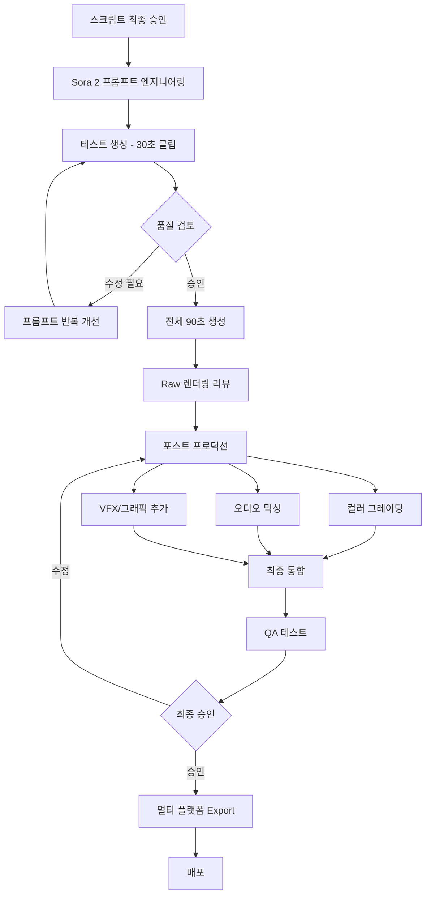

# Sam Altman x 경주 불국사 (Bulguksa Temple) - Sora 2 프롬프트

## 🎬 프로젝트 정보
- **제목**: "Sam's Journey to Bulguksa: Where Ancient Wisdom Meets AI"
- **목적**: 샘 올트먼이 한국의 세계문화유산 불국사를 소개하며, 전통과 현대 기술의 조화를 보여주는 콘텐츠
- **대상**: APEC CEO Summit 참석자, 글로벌 기술 리더, 한국 문화에 관심 있는 전세계 관객
- **Duration**: 90초 (3개 Act로 구성)

---

## 📝 메인 Sora 2 프롬프트

```
[Sora 2 Prompt - Duration: 90 seconds - Cinematic Documentary Style]

=== ACT 1: ARRIVAL - "The Journey Begins" (0-30s) ===

OPENING SHOT (0-8s):
Aerial drone shot sweeping over misty mountains of Gyeongju at dawn. Golden hour light breaking through morning fog. Camera glides over traditional Korean pine forests, revealing curved temple roofs in the distance.

TRANSITION (8-12s):
Descend through the mist. Camera follows a winding stone path (돌계단) leading up the mountain. Ancient stone lanterns line the path, covered in soft moss. Peaceful, meditative atmosphere.

SAM'S ENTRANCE (12-30s):
- Medium shot: Sam Altman walks up the stone steps, wearing casual business attire (dark sweater, comfortable pants)
- His expression: Curious, respectful, taking in the beauty
- CAMEO Integration: Use reference images to ensure authentic likeness
- Camera: Follows him with steady gimbal movement, occasionally shifting to his POV
- Details to capture:
  * His hand gently touching ancient stone railings
  * Morning light filtering through pine trees creating god rays
  * Sound of gravel under feet (audio cue)
  * Distant temple bell ringing (범종 소리)

VISUAL STYLE:
- Color grading: Cool morning blues transitioning to warm golden tones
- Reference: Korean historical drama cinematography meets National Geographic
- Authentic Korean temple atmosphere: Incense smoke visible, traditional architecture details

TEXT OVERLAY (appears at 25s):
"Bulguksa Temple, Gyeongju, Korea"
"UNESCO World Heritage Site - Built 751 AD"

=== ACT 2: DISCOVERY - "Ancient Innovation" (30-60s) ===

STONE BRIDGE SEQUENCE (30-45s):
- Sam stands before Cheongungyo and Baegungyo (청운교·백운교) - the famous stone bridges
- Wide shot establishing the architectural marvel
- Camera slowly pushes in as Sam examines the structure
- Close-ups: His fingers tracing the perfectly fitted stones (no mortar, 1,300 years old)
- INSERT SHOT: Architectural detail - stones locked together with ancient engineering precision

VISUAL EFFECT (subtle, meaningful):
- AR-style overlay appears (NOT intrusive, elegant):
  * Faint blueprint lines showing the bridge's architectural logic
  * Golden ratio calculations (Fibonacci spiral) overlay
  * Side-by-side comparison: Ancient Korean engineering principles <-> Modern AI neural network patterns
- This visual metaphor connects: Ancient wisdom = foundational layers, just like AI training

SAM'S REALIZATION MOMENT (45-55s):
- Medium close-up: Sam's face, genuine expression of awe
- He speaks (if dialogue sync possible, or text overlay):
  "These monks built systems to last centuries...
   They understood layers, foundations, iteration.
   Not so different from training large models."
- Camera slowly orbits around him 90 degrees
- Background: Dabotap Pagoda (다보탑) comes into frame - intricate stone structure

DABOTAP PAGODA SHOWCASE (55-60s):
- Sweeping shot around Dabotap (National Treasure No. 20)
- Highlight: Complex geometric design, multiple layers, perfect symmetry
- VFX: Very subtle particle effects showing mathematical harmony (sacred geometry)
- This pagoda represents: Complexity from simplicity, iteration toward perfection

VISUAL METAPHOR:
Traditional Korean architecture demonstrates:
- Modular design (like transformers in AI)
- Layers building on layers (deep learning)
- Beauty through mathematical precision (optimization)

=== ACT 3: CONNECTION - "Past Meets Future" (60-90s) ===

MAIN HALL APPROACH (60-70s):
- Sam walks toward Daeungjeon (대웅전, Main Buddha Hall)
- Camera: Wide shot from low angle, emphasizing grandeur
- Lighting: Warm afternoon sun creates dramatic shadows
- Architectural details: Curved roof (처마), painted eaves (단청), wooden pillars
- Pilgrims and visitors visible (diverse, international), showing living heritage

INTERIOR MOMENT (70-80s):
- Sam enters the hall (shoes removed, respectful posture)
- Soft, diffused light through paper windows (한지 창호)
- Golden Buddha statue (Seokgamoni Buddha) softly glowing
- Sam bows slightly (respectful gesture, culturally appropriate)
- Close-up: His face illuminated by candlelight, moment of reflection
- SOUND: Monk's chanting (염불) very softly in background

FINAL SEQUENCE (80-90s):
- Sam exits the hall, stands on the terrace overlooking the temple complex
- Camera pulls back to reveal:
  * Foreground: Sam contemplating
  * Mid-ground: 1,300-year-old temple structures
  * Background: Modern Gyeongju city skyline (but subtle, not intrusive)
- Sunset golden hour lighting (magic hour)
- AR elements appear subtly around the scene:
  * Floating holographic lotus lanterns (연등)
  * Soft digital cherry blossoms (벚꽃) drifting
  * Text particles forming Korean characters → English:
    "過去와 未來" → "Past & Future"
    "知慧" → "Wisdom"

SAM'S CLOSING (85-90s):
- He looks at camera with warm, genuine smile
- Text overlay (or dialogue):
  "True innovation honors what came before.
   Korea has been building for the future... for 1,300 years."

FINAL FRAME:
- Fade to black
- Text appears:
  "Experience Korean Heritage with AI"
  "NERDX x OpenAI Sora"
  "#KoreanJoy #APEC2025"
  "Create your own Korean story at nerdx.com/cameo"

=== END ===

---

## 🎨 스타일 가이드

### CINEMATOGRAPHY:
- **Camera Movement**: Slow, deliberate, meditative
- **Shot Types**:
  * Wide establishing shots (show scale, context)
  * Medium shots (Sam's journey)
  * Close-ups (emotional beats, architectural details)
- **Frame Rate**: 24fps (cinematic, film-like quality)
- **Aspect Ratio**: 16:9 (optimized for YouTube, social media)
- **Reference Directors**:
  * Park Chan-wook (for color and composition)
  * Terrence Malick (for natural light and spirituality)
  * Documentary style of "Abstract: The Art of Design"

### LIGHTING:
- **Time of Day**: Golden hour (sunrise and sunset scenes)
- **Quality**: Soft, natural, respectful of sacred space
- **Color Temperature**: Warm (2800K-4500K)
- **Practical Lights**: Temple lanterns, candles (all authentic)
- **Avoid**: Harsh shadows, artificial studio lighting

### COLOR GRADING:
- **Palette**:
  * Earth tones (stone gray, wood brown, temple roof green)
  * Accents of traditional dancheong colors (청홍황녹백)
  * Golden highlights for divine/special moments
- **LUT Style**: "Korean Cinema" look - slightly desaturated with warm highlights
- **Contrast**: Medium (not too crushed blacks, preserve shadow detail)

### AUDIO:
- **Music**:
  * Opening: Traditional Korean instruments (가야금, 대금)
  * Build: Orchestral swell with Korean percussion (장구, 징)
  * Closing: Fusion of traditional and modern ambient electronic
- **Sound Design**:
  * Temple bell (종소리)
  * Wind through pine trees
  * Gravel footsteps
  * Distant monk chanting
  * Birds chirping (natural ambience)
- **Dialogue**: Minimal, impactful (Sam speaks only 2-3 lines)

---

## 🎭 캐릭터 디렉션: Sam Altman

### PERFORMANCE NOTES:
- **Energy**: Calm, curious, genuinely moved (not performative)
- **Physicality**:
  * Walks with purpose but not haste
  * Respectful body language (hands clasped, slight bow)
  * Genuine facial expressions (wonder, contemplation, joy)
- **Eye Line**:
  * Looking at architecture (studying)
  * Looking into the distance (reflecting)
  * Looking at camera (only for closing line, direct connection)
- **Wardrobe**:
  * Casual but respectful
  * Dark neutral colors (navy, charcoal)
  * Tech CEO aesthetic but not too Silicon Valley

### CAMEO TECHNICAL SPECS:
```json
{
  "reference_images": [
    "sam_altman_frontal_neutral.jpg",
    "sam_altman_profile_smile.jpg",
    "sam_altman_walking_candid.jpg"
  ],
  "age_appearance": "late 30s",
  "facial_features_priority": [
    "eye_shape",
    "smile_pattern",
    "facial_structure"
  ],
  "blend_strength": 0.90,
  "motion_capture": "natural_walking_contemplative"
}
```

---

## 🏛️ 불국사 (Bulguksa) 문화적 정확성 체크리스트

### 필수 포함 요소:
- ✅ Dabotap Pagoda (다보탑) - 국보 20호
- ✅ Seokgatap Pagoda (석가탑) - 국보 21호
- ✅ Cheongungyo & Baegungyo (청운교·백운교) - 국보 23호
- ✅ Daeungjeon (대웅전) - 주불전
- ✅ Traditional Korean temple architecture (기와지붕, 단청)
- ✅ Natural mountain setting (경주 토함산)

### 문화적 고려사항:
- ❗ 신발 벗기: 불전 내부 진입 시 반드시 표현
- ❗ 경건한 태도: 종교적 공간에 대한 존중 표현
- ❗ 사진 촬영 금지 구역: 실제 촬영 시 허가 필요
- ❗ 복장: 과도한 노출 없는 단정한 복장
- ❗ 스님들의 일상: 방해하지 않는 선에서 자연스럽게

### 피해야 할 것:
- ❌ 불상에 직접 손대는 행위
- ❌ 시끄럽거나 경망스러운 행동
- ❌ 종교적 상징물을 장난스럽게 다루기
- ❌ 문화적 오해를 일으킬 수 있는 제스처

---

## 📊 기술 사양

### SORA 2 API 호출 Parameters:
```json
{
  "model": "sora-2-preview",
  "prompt": "[위의 전체 프롬프트]",
  "duration": 90,
  "aspect_ratio": "16:9",
  "fps": 24,
  "quality": "maximum",
  "style_consistency": true,
  "temporal_coherence": "high",
  "physics_accuracy": true,
  "lighting_model": "physically_based",
  "cameo_integration": {
    "enabled": true,
    "character_name": "Sam Altman",
    "face_reference_urls": [
      "https://storage.nerdx.com/references/sam_altman_ref1.jpg",
      "https://storage.nerdx.com/references/sam_altman_ref2.jpg"
    ],
    "performance_style": "documentary_natural",
    "blend_quality": "seamless"
  },
  "location_tags": [
    "Bulguksa Temple",
    "Gyeongju",
    "South Korea",
    "UNESCO World Heritage"
  ],
  "cultural_sensitivity": "high",
  "brand_safety": {
    "enabled": true,
    "prohibited_elements": [
      "disrespectful_religious_content",
      "cultural_appropriation",
      "political_statements"
    ]
  },
  "audio_requirements": {
    "music_style": "korean_traditional_cinematic_fusion",
    "dialogue_language": "english",
    "ambient_sound": "natural_temple_environment"
  },
  "watermark": {
    "text": "NERDX x OpenAI Sora | #KoreanJoy",
    "position": "bottom_right",
    "opacity": 0.7
  }
}
```

### 후처리 (Post-Production):
- **Color Correction**: DaVinci Resolve (Korean Cinema LUT)
- **Audio Mixing**: Pro Tools (Dolby Atmos mix)
- **VFX Touch-ups**: After Effects (AR elements, text overlays)
- **Subtitles**: English (primary), Korean, Chinese, Japanese
- **Export Formats**:
  * YouTube: 4K HDR, 24fps
  * Instagram: 1080p, 9:16 vertical cut
  * TikTok: 1080p, 9:16 vertical cut
  * Twitter: 1080p, 16:9
  * APEC Presentation: 4K ProRes, 24fps

---

## 🎯 콘텐츠 목표 및 KPI

### 1차 목표 (Primary Goals):
- **감성적 연결**: 시청자가 한국 문화유산에 대한 존중과 호기심을 갖게 함
- **샘 올트먼 브랜드 연계**: 기술 리더가 전통 문화를 존중하는 모습
- **NERDX 브랜드 포지셔닝**: "전통과 혁신의 조화"를 추구하는 브랜드

### 2차 목표 (Secondary Goals):
- **바이럴 잠재력**: 공유하고 싶은 아름다운 콘텐츠
- **교육적 가치**: 불국사에 대한 실제 정보 전달
- **CTA 전환**: CAMEO 생성 페이지로 유도

### KPI:
| 지표 | 목표 | 측정 시점 |
|------|------|-----------|
| YouTube 조회수 | 3M+ | 4주 이내 |
| 평균 시청 지속률 | 70%+ | - |
| 소셜 미디어 공유 | 50K+ | 2주 이내 |
| CAMEO 페이지 전환율 | 12%+ | - |
| 긍정 댓글 비율 | 85%+ | - |
| 언론 보도 | 30+ 매체 | 1주 이내 |

---

## 🚀 제작 워크플로우



### 예상 타임라인:
- **프롬프트 개선**: 2-3일
- **Sora 2 생성**: 1일 (여러 iteration)
- **포스트 프로덕션**: 3-4일
- **승인 프로세스**: 2일
- **총 소요 시간**: 약 1.5주

---

## 💡 확장 아이디어

### 시리즈 콘셉트: "Sam's Korean Heritage Journey"
1. **에피소드 1**: 경주 불국사 (이 프롬프트)
2. **에피소드 2**: 전주 한옥마을 (전통주 양조장)
3. **에피소드 3**: 서울 경복궁 (왕실 문화와 AI)
4. **에피소드 4**: 부산 해운대 (현대 한국의 역동성)

### 인터랙티브 확장:
- **유저 CAMEO 버전**: "나만의 불국사 여행" 템플릿
- **AR 체험**: NERDX 제품으로 불국사 가상 투어 언락
- **교육 콘텐츠**: 불국사 건축의 수학적 원리 설명 (STEM 교육)

---

## ✅ 승인 체크리스트

### 필수 승인:
- [ ] **NERDX 브랜드 팀**: 브랜드 메시지 정렬
- [ ] **OpenAI 파트너십 팀**: 샘 올트먼 초상권, Sora 사용 승인
- [ ] **문화재청 (한국)**: 불국사 촬영/재현 허가
- [ ] **불국사 사찰**: 종교적 존중 확인
- [ ] **법무팀**: 저작권, 초상권, 면책조항
- [ ] **APEC 조직위**: 이벤트 연계 승인

### 제작 전 확인사항:
- [ ] 샘 올트먼 참조 이미지 권리 확보
- [ ] 불국사 현장 촬영 참조 이미지/영상 확보
- [ ] 음악 라이센스 확보
- [ ] 성우/나레이션 계약 (필요시)
- [ ] 보험 가입 (제작 리스크)

---

## 📝 법적 고지사항 (영상 내 포함)

```
이 영상은 OpenAI Sora 2를 사용하여 생성된 AI 콘텐츠입니다.
실제 촬영 장면과 AI 생성 장면이 혼합되어 있을 수 있습니다.

불국사는 대한민국 국보 및 UNESCO 세계문화유산입니다.
모든 문화재는 존중과 보호의 대상입니다.

This video contains AI-generated content created with OpenAI Sora 2.
Bulguksa Temple is a Korean National Treasure and UNESCO World Heritage Site.

© 2025 NERDX. All Rights Reserved.
Produced in partnership with OpenAI.
```

---

## 🎬 결론

이 프롬프트는 단순한 관광 홍보가 아닌, **"기술과 전통의 대화"**를 만들어냅니다.

샘 올트먼이라는 현대 기술의 상징이 1,300년 된 한국의 지혜와 만나는 순간을 통해:
- NERDX의 브랜드 철학 구현
- 한국 문화유산의 글로벌 가치 재조명
- AI 기술의 문화적 적용 가능성 제시

**"과거의 혁신이 미래의 영감이 된다"** - 이것이 이 영상의 핵심 메시지입니다.

---

**제작**: NERDX Content Team
**기술 파트너**: OpenAI Sora 2
**문화 자문**: 국립경주문화재연구소
**버전**: 1.0
**최종 수정**: 2025-10-10
